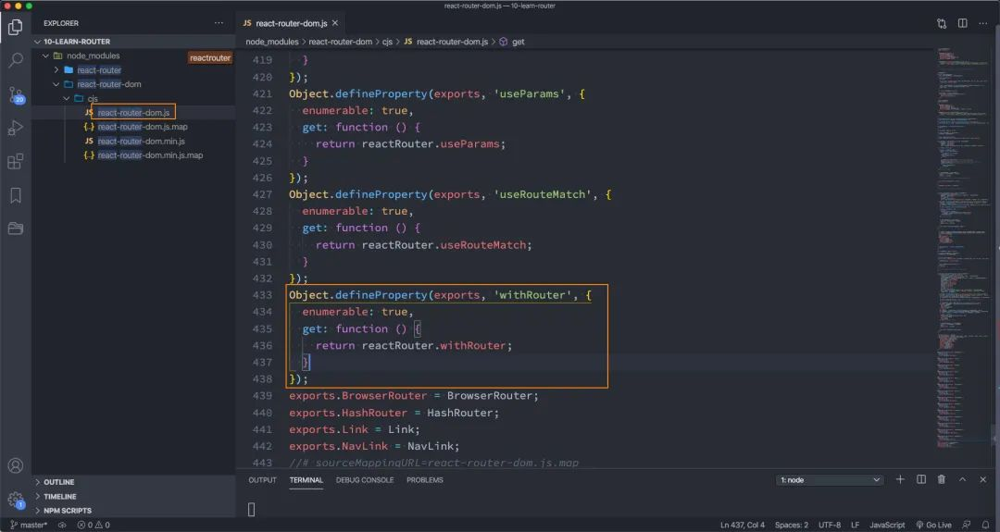
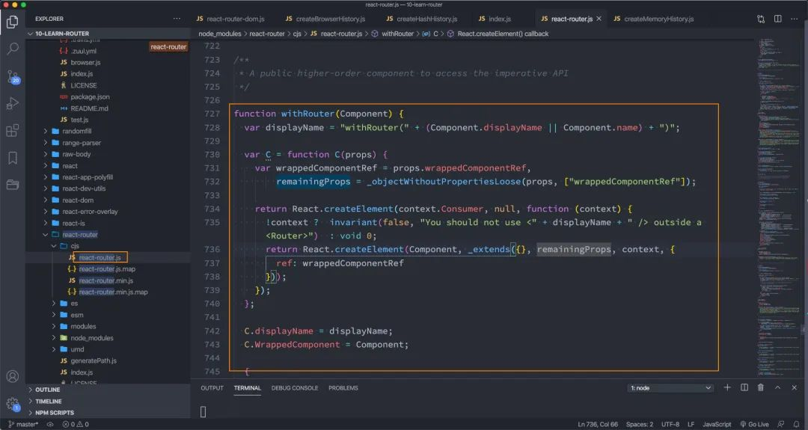
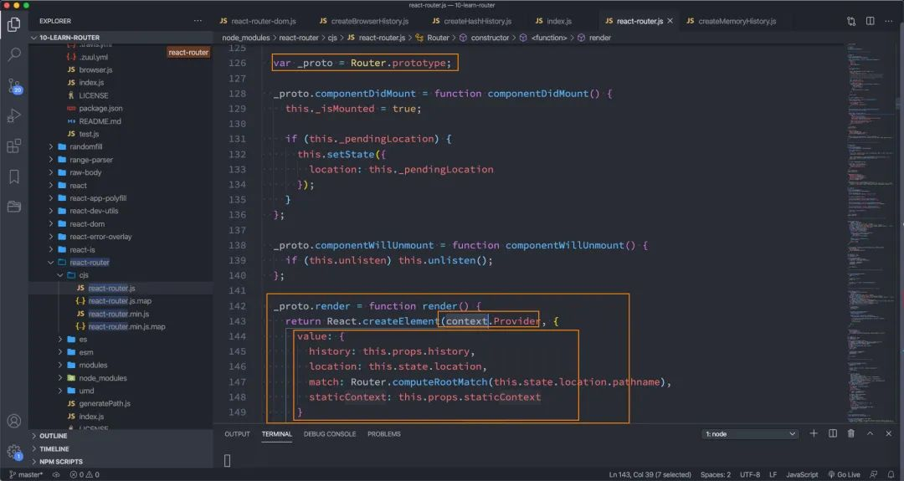
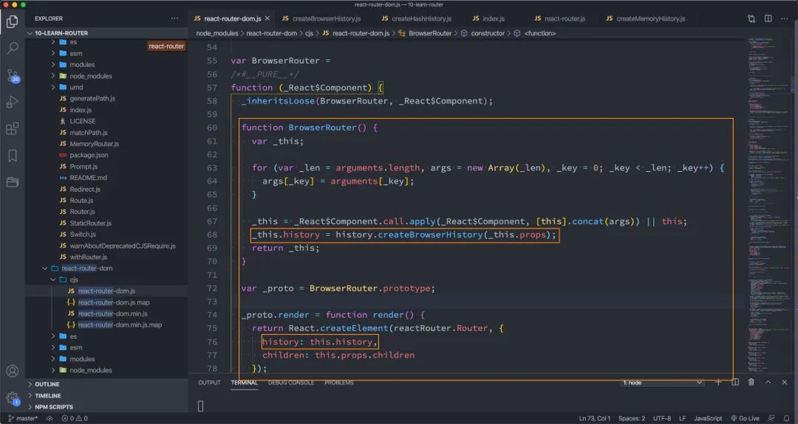
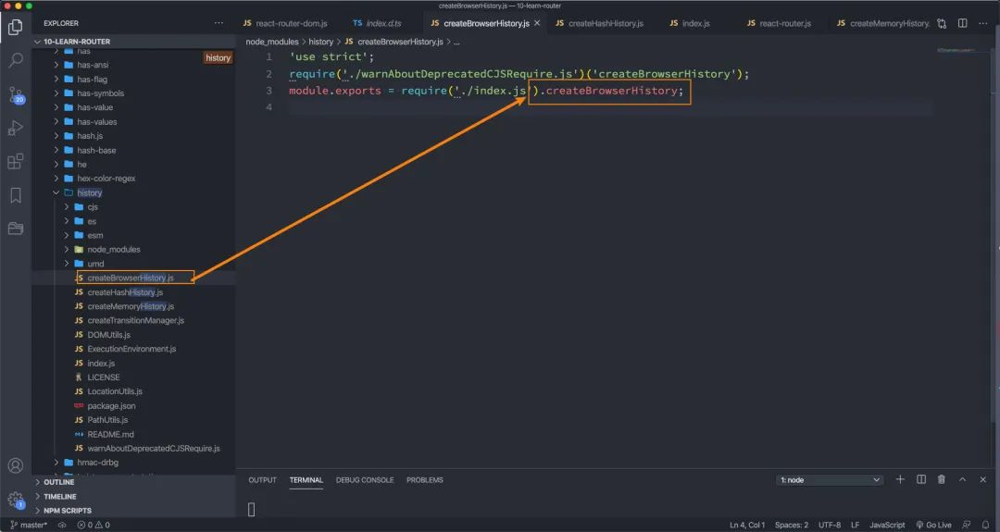
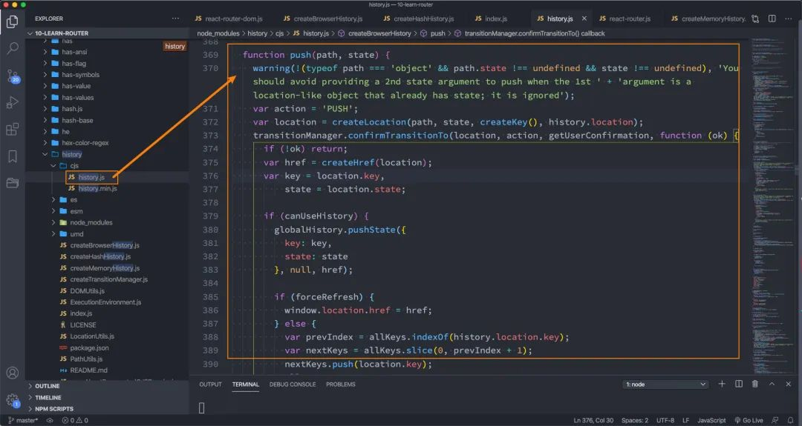
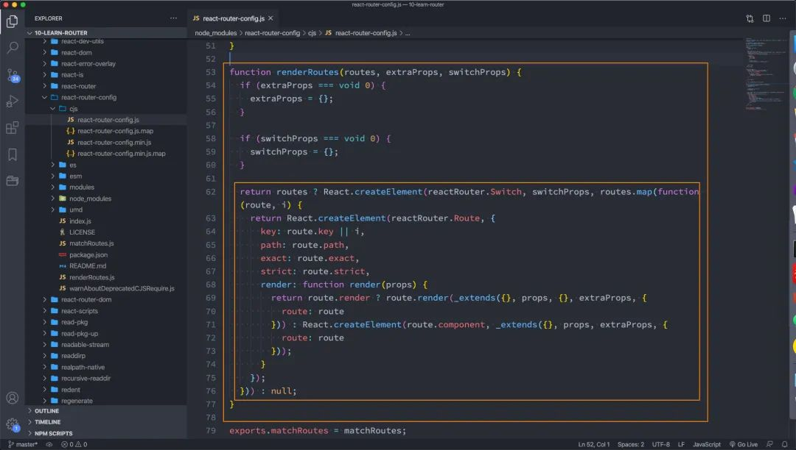

### 认识react-router
1. 认识前端路由
路由其实是网络工程中的一个术语：在架构一个网络时，非常重要的两个设备就是路由器和交换机。
当然，目前在我们生产中路由器也是越来越被大家所熟知，因为我们生活中都会用到路由器：
  - 事实上，路由器主要维护的是一个映射表；
  - 映射表会决定数据的流向；

路由的概念出现最早是在后端路由中实现的，原因是web的发展主要经历了这样一些阶段：
  - 后端路由阶段；
  - 前后端分离阶段；
  - 单页面富应用（SPA）；

- **阶段一：后端路由阶段**
早期的网站开发整个HTML页面是由服务器来渲染的：服务器直接生产渲染好对应的HTML页面, 返回给客户端进行展示.
但是, 一个网站, 这么多页面服务器如何处理呢?
  - 一个页面有自己对应的网址, 也就是URL.
  - URL会发送到服务器, 服务器会通过正则对该URL进行匹配, 并且最后交给一个Controller进行处理.
  - Controller进行各种处理, 最终生成HTML或者数据, 返回给前端.
  - 这就完成了一个IO操作.

上面的这种操作, 就是后端路由.
  - 当我们页面中需要请求不同的路径内容时, 交给服务器来进行处理, 服务器渲染好整个页面, 并且将页面返回给客户端.
  - 这种情况下渲染好的页面, 不需要单独加载任何的js和css, 可以直接交给浏览器展示, 这样也有利于SEO的优化.
后端路由的缺点:
  - 一种情况是整个页面的模块由后端人员来编写和维护的.
  - 另一种情况是前端开发人员如果要开发页面, 需要通过PHP和Java等语言来编写页面代码.
  - 而且通常情况下HTML代码和数据以及对应的逻辑会混在一起, 编写和维护都是非常糟糕的事情.

- **阶段二：前后端分离阶段**
前端渲染的理解：
  - 每次请求涉及到的静态资源都会从静态资源服务器获取，这些资源包括HTML+CSS+JS，然后在前端对这些请求回来的资源进行渲染；
  - 需要注意的是，客户端的每一次请求，都会从静态资源服务器请求文件；
  - 同时可以看到，和之前的后端路由不同，这时后端只是负责提供API了；
前后端分离阶段：
  - 随着Ajax的出现, 有了前后端分离的开发模式；
  - 后端只提供API来返回数据，前端通过Ajax获取数据，并且可以通过JavaScript将数据渲染到页面中；
  - 这样做最大的优点就是前后端责任的清晰，后端专注于数据上，前端专注于交互和可视化上；
  - 并且当移动端(iOS/Android)出现后，后端不需要进行任何处理，依然使用之前的一套API即可；
  - 目前很多的网站依然采用这种模式开发（jQuery开发模式）；

- **阶段三：单页面富应用（SPA）**
单页面富应用的理解：
  - 单页面富应用的英文是single-page application，简称SPA；
  - 整个Web应用只有实际上只有一个页面，当URL发生改变时，并不会从服务器请求新的静态资源；
  - 而是通过JavaScript监听URL的改变，并且根据URL的不同去渲染新的页面；
如何可以应用URL和渲染的页面呢--前端路由
  - 前端路由维护着URL和渲染页面的映射关系；
  - 路由可以根据不同的URL，最终让我们的框架（比如Vue、React、Angular）去渲染不同的组件；
  - 最终我们在页面上看到的实际就是渲染的一个个组件页面；

2. 前端路由原理
前端路由是如何做到URL和内容进行映射呢？监听URL的改变。
- URL的hash
  + URL的hash也就是锚点(#), 本质上是改变window.location的href属性；
  + 我们可以通过直接赋值location.hash来改变href, 但是页面不发生刷新；
  ```html
    <div id="app">
      <a href="#/home">home</a>
      <a href="#/about">about</a>
      <div class="router-view"></div>
    </div>

    <script>
      // 1.获取router-view
      const routerViewEl = document.querySelector(".router-view");

      // 2.监听hashchange
      window.addEventListener("hashchange", () => {
        switch(location.hash) {
          case "#/home":
            routerViewEl.innerHTML = "home";
            break;
          case "#/about":
            routerViewEl.innerHTML = "about";
            break;
          default:
            routerViewEl.innerHTML = "default";
        }
      })
    </script>
  ```
hash的优势就是兼容性更好，在老版IE中都可以运行，但是缺陷是有一个#，显得不像一个真实的路径。

- HTML5的History
history接口是HTML5新增的, 它有六种模式改变URL而不刷新页面：
  - replaceState：替换原来的路径；
  - pushState：使用新的路径；
  - popState：路径的回退；
  - go：向前或向后改变路径；
  - forword：向前改变路径；
  - back：向后改变路径；
  我们这里来简单演示几个方法：
  ```html
    <div id="app">
      <a href="/home">home</a>
      <a href="/about">about</a>
      <div class="router-view"></div>
    </div>

    <script>
      // 1.获取router-view
      const routerViewEl = document.querySelector(".router-view");

      // 2.监听所有的a元素
      const aEls = document.getElementsByTagName("a");
      for (let aEl of aEls) {
        aEl.addEventListener("click", (e) => {
          e.preventDefault();
          const href = aEl.getAttribute("href");
          console.log(href);
          history.pushState({}, "", href);
          historyChange();
        })
      }

      // 3.监听popstate和go操作
      window.addEventListener("popstate", historyChange);
      window.addEventListener("go", historyChange);

      // 4.执行设置页面操作
      function historyChange() {
        switch(location.pathname) {
          case "/home":
            routerViewEl.innerHTML = "home";
            break;
          case "/about":
            routerViewEl.innerHTML = "about";
            break;
          default:
            routerViewEl.innerHTML = "default";
        }
      }

    </script>
  ```

3. react-router
目前前端流行的三大框架, 都有自己的路由实现:
  - Angular的ngRouter
  - React的ReactRouter
  - Vue的vue-router

React Router的版本4开始，路由不再集中在一个包中进行管理了：
  - react-router是router的核心部分代码；
  - react-router-dom是用于浏览器的；
  - react-router-native是用于原生应用的；

目前我们使用最新的React Router版本是v5的版本：
  - 实际上v4的版本和v5的版本差异并不大；

安装react-router：
  - 安装react-router-dom会自动帮助我们安装react-router的依赖：`yarn add react-router-dom`

### react-router基本使用
1. Router基本使用
react-router最主要的API是给我们提供一些组件
  - BrowserRouter 或 HashRouter
    + Router 中包含了对路径改变的监听，并且会将相应的路径传递给子组件
    + BrowserRouter使用history模式；
    + HashRouter使用hash模式；
  
  - Link 和 NavLink
    + 通常路径的跳转是使用Link组件，最终会被渲染成a元素
    + NavLink是在Link的基础上增加了一些样式属性
    + to属性：Link中最重要的属性，用于设置跳转到的路径
  
  - Router
    + Router用于路径的匹配
    + path属性：用于设置匹配到的路径
    + component属性：设置匹配到路径后渲染的组件
    + exact：精准匹配，只有精准匹配到完全一致的路径，才会渲染对应的组件

在 App 中进行如下练习
```jsx
import React, { PureComponent } from 'react'
import { BrowserRouter, Route, Link } from 'react-router-dom'

import Home from './Home'
import About from './About'
import Profile from './Profile'

export default class App extends PureComponent {
  render() {
    return (
      <BrowserRouter>
        <Link to="/">首页</Link>
        <Link to="/about">关于</Link>
        <Link to="/profile">我的</Link>

        <Router exact path="/" component={Home} />
        <Router exact path="/about" component={About} />
        <Router exact path="/profile" component={Profile} />
      </BrowserRouter>
    )
  }
}
```

2. NavLink 的使用
路径选中时，对应的a元素变为红色
这个时候，我们要使用NavLink组件来代替Link组件
  - activeStyle：活跃时（匹配时）的样式
  - activeClassName：活跃时添加的class
  - exact：是否精准匹配

先演示activeStyle
```jsx
<NavLink to="/" activeStyle={{color: "red"}}>我的</NavLink>
<NavLink to="/about" activeStyle={{color: "red"}}>关于</NavLink>
<NavLink to="/profile" activeStyle={{color: "red"}}>我的</NavLink>
```
但是，我们会发现在选中about或profile时，第一个也会变成红色
  - 原因是 / 路径也匹配到了 /about 和 /profile
  - 这个时候，可以在第一个NavLink中添加上exact属性；
```jsx
  <NavLink exact to="/" activeStyle={{color: "red"}}>我的</NavLink>
```
默认的activeClassName：
  - 事实上在默认匹配成功时，NavLink就会添加上一个动态的 active class
  - 所以我们也可以直接编写样式
  ```css
    a.active {
      color: red;
    }
  ```
当然，如果你担心这个class在其他地方被使用了，出现样式的层叠，也可以自定义class
```jsx
<NavLink exact to="/" activeClassName="link-active">首页</NavLink>
<NavLink to="/about" activeClassName="link-active">关于</NavLink>
<NavLink to="/profile" activeClassName="link-active">我的</NavLink>
```

3. Switch的作用
我们来看下面的路由规则
  - 当我们匹配到某一个路径时，我们会发现有一些问题
  - 比如 /about 路径匹配到的同时， /:userid 也被匹配到了，并且最后一个NoMatch组件总是被匹配到
```jsx
<Route exact path="/" component={Home} />
<Route path="/about" component={About} />
<Route path="/profile" component={Profile} />
<Route path="/:userid" component={User} />
<Route path="/profile" component={Profile} />
<Route component={NoMatch} />
```
原因是什么呢？默认情况下，react-router中只要是路径被匹配到的Route对应的组件都会被渲染；
但实际开发中，我们往往希望有一种排他的思想：
  - 只要匹配到了第一个，那么后面的就不应该继续匹配了
  - 这时候我们可以*使用Switch来将所有的Route进行包裹即可*
```jsx
<Switch>
  <Route exact path="/" component={Home} />
  <Route path="/about" component={About} />
  <Route path="/profile" component={Profile} />
  <Route path="/:userid" component={User} />
  <Route component={NoMatch} />
</Switch>
```

4. Redirect 的使用
Redirect 用于路由的重定向，当这个组件出现时，就会执行跳转到对应的to路径中。我们这里使用这样的一个案例：
- 用户跳转到User界面
- 但是在User界面有一个isLogin用于记录用户是否登录
  + true：显示用户的名称
  + false：直接重定向到登录页面

App.js 中提前定义好 Login 页面对应的Route
```jsx
<Switch>
  ...其他的Route
  <Route to="/login" component={Login} />
  <Route component={NoMatch} />
</Switch>
```
在User.js 中写上对应的逻辑代码
```jsx
import React, { PureComponent } from 'react'
import { Redirect } from 'react-router-dom';

export default class User extends PureComponent {
  constructor(props) {
    super(props);

    this.state = {
      isLogin: false
    }
  }

  render() {
    return this.state.isLogin ? (
      <div>
        <h2>User</h2>
        <h2>用户名：coderwhy</h2>
      </div>
    ) : <Redirect to="/login" />
  }
}
```

### react-router高级使用
1. 路由嵌套
在开发中，路由之间是存在嵌套关系的
这里我们假设about页面中有两个页面内容
  - 商品列表和消息列表
  - 点击不同的链接可以跳转到不同的地方，显示不同的内容
```jsx
import React, { PureComponent } from 'react';
import { Route, Switch, Link } from 'react-router-dom';

function AboutProduct() {
  return (
    <ul>
      <li>商品列表1</li>
      <li>商品列表2</li>
      <li>商品列表3</li>
    </ul>
  )
}

function AboutMessage() {
  return (
    <ul>
      <li>消息列表1</li>
      <li>消息列表2</li>
      <li>消息列表3</li>
    </ul>
  )
}

export default class About extends PureComponent {
  render() {
    return (
      <div>
        <Link to="/about">商品</Link>
        <Link to="/about/message">消息</Link>

        <Switch>
          <Route exact path="/about" component={AboutProduct} />
          <Route path="/about/message" component={AboutMessage} />
        </Switch>
      </div>
    )
  }
}
```

2. 手动跳转
目前我们实现的跳转主要是通过 Link 或者 NavLink 进行跳转的，实际上我们也可以通过 javascript 代码来实现跳转。
但是通过javascript代码进行跳转有一个前提：*必须获取到 history 对象*
如何获取到 history 对象呢？
  - 方式一：如果该组件是通过路由直接跳转过来的，那么可以直接获取history、location、match对象
  - 方式二：如果该组件是一个普通渲染的组件，那么不可以直接获取history、location、match对象
    + 如果普通组件也想获取对应的对象属性应该怎么做呢？
      - 通过高阶组件，可以在组件中添加想要的属性
      - react-router也是通过高阶组件为我们的组件添加相关的属性的
如果我们希望在App组件中获取到history对象，必须满足一下两个条件
  - App 组件必须包裹在Route组件内
  - App 组件使用WithRouter高阶组件包裹

index.js 代码修改如下
```jsx
ReactDOM.render(
  <BrowserRouter>
    <App />
  </BrowserRouter>,
  document.getElementById('root')
)
```
App.js 代码修改如下：
```jsx
import { Route, Switch, NavLink, withRouter } from 'react-router-dom';
...省略其他的导入代码

class App extends PureComponent {
  render() {
    console.log(this.props.history);

    return (
      <div>
        ...其他代码
        <button onClick={e => this.pushToProfile()}>我的</button>

        <Switch>
          <Route exact path="/" component={Home} />
          <Route path="/about" component={About} />
          <Route path="/profile" component={Profile} />
          <Route path="/:userid" component={User} />
          <Route component={NoMatch} />
        </Switch>
      </div>
    )
  }

  pushToProfile() {
    this.props.history.push('/profile')
  }
}

export default withRouter(App)
```
**源码选读**
这里的history来自哪里呢？是否和之前使用的window.history一样呢？
我们发现withRouter的高阶函数来自react-router-dom：
- 实际上来自react-router的包；

withRouter函数：

history对象来自哪里呢？
  - 实际来自上面代码的context；
  
这个context的值来自哪里呢？
  - 来自于context.Consumer的value中；
  
this.props.history来自哪里呢？
  - 来自BrowserRouter或者HashRouter在创建时，传入的值；
  - 又传递给了Router，Router的子组件可以通过该context获取到这个值；
  
createBrowserHistory来自哪里呢？

执行push操作的本质：


3. 传递参数
传递参数有三种方式：
  - 动态路由的方式
  - search传入参数
  - to传入对象

**动态路由的方式**
动态路由是指路由中的路径并不会固定
  - 比如 /detail 的path对应一个组件Detail
  - 如果我们将path在Route匹配时写成 /detail/:id ，那么 /detail/abc 、 /detail/123 都可以匹配到该Route，并且进行显示
  - 这个匹配规则，我们就称之为动态路由
通常情况下，使用动态路由可以为路由传递参数
```jsx
<div>
 ...其他Link
  <NavLink to="/detail/abc123">详情</NavLink>

  <Switch>
    ... 其他Route
    <Route path="/detail/:id" component={Detail}/>
    <Route component={NoMatch} />
  </Switch>
</div>
```
detail.js的代码如下：
  - 我们可以直接通过match对象中获取id
  - 这里我们没有使用withRouter，原因是因为Detail本身就是通过路由进行的跳转
```jsx
import React, { PureComponent } from 'react'

export default class Detail extends PureComponent { 
  render() {
    console.log(this.props.match.params.id)

    return (
      <div>
        <h2>Detail: {this.props.match.params.id}</h2>
      </div>
    )
  }
}
```

**search传递参数**
NavLink写法：
  - 我们在跳转的路径中添加了一些query参数；
```jsx
<NavLink to="/detail2?name=why&age=18">详情2</NavLink>
<Switch>
  <Route path="/detail2" component={Detail2}></Route>
</Switch>
```
Detail2中如何获取呢？
  - Detail2中是需要在location中获取search的；
  - 注意：这个search没有被解析，需要我们自己来解析；
```jsx
import React, { PureComponent } from 'react'

export default class Detail2 extends PureComponent {
  render() {
    console.log(this.props.location.search)  // ?name=why&age=18

    return (
      <div>
        <h2>Detail2: {this.props.location.search}</h2>
      </div>
    )
  }
}
```
**to传入对象**
to可以直接传入一个对象
```jsx
<NavLink
  to={{
    pathname: "/detail2",
    query: {name: "kobe", age: 30},
    state: {height: 1.98, address: "洛杉矶"},
    search: "?apikey=123"
  }}
>详情2</NavLink>
```
获取参数：
```jsx
import React, { PureComponent } from 'react'

export default class Detail2 extends PureComponent {
  render() {
    console.log(this.props.location);

    return (
      <div>
        <h2>Detail2:</h2>
      </div>
    )
  }
}
```

### react-router-config
目前我们所有的路由定义都是直接使用Route组件，并且添加属性来完成的。
但是这样的方式会让路由变得非常混乱，我们希望将所有的路由配置放到一个地方进行集中管理：
  - 这时候可以使用 react-router-config 来完成
安装react-router-config：`yarn add react-router-config`

常见 router/index.js 文件
```jsx
import Home from '../pages/home'
import About, { AboutMessage, AboutProduct } from '../pages/about'
import Profile from "../pages/profile";
import Login from "../pages/login";
import User from "../pages/user";
import Detail from "../pages/detail";
import Detail2 from "../pages/detail2";
import NoMatch from "../pages/nomatch";

const routes = [
  {
    path: '/',
    exact: true,
    component: Home
  },
  {
    path: "/about",
    component: About,
    routes: [
      {
        {
          path: "/about",
          exact: true,
          component: AboutProduct
        },
        {
          path: "/about/message",
          exact: true,
          component: AboutMessage
        },
      }
    ]
  },
  {
    path: "/profile",
    component: Profile
  },
  {
    path: "/login",
    component: Login
  },
  {
    path: "/user",
    component: User
  },
  {
    path: "/detail/:id",
    component: Detail
  },
  {
    path: "/detail2",
    component: Detail2
  },
  {
    component: NoMatch
  }
]

export default routes;
```
将之前的Switch配置，换成react-router-config中提供的renderRoutes函数：
```jsx
{renderRoutes(routes)}

{/* <Switch>
     <Route exact path="/" component={Home} />
      <Route path="/about" component={About} />
      <Route path="/profile" component={Profile} />
      <Route path="/user" component={User} />
      <Route path="/login" component={Login} />
      <Route path="/detail/:id" component={Detail}/>
      <Route path="/detail2" component={Detail2}/>
      <Route component={NoMatch} />
 </Switch> */}
```
如果是子组件中，需要路由跳转，那么需要在子组件中使用renderRoutes函数：
  - 在跳转到的路由组件中会多一个 this.props.route 属性；
  - 该route属性代表当前跳转到的路由对象，可以通过该属性获取到 routes；
```jsx
export default class About extends PureComponent {
  render() {
    <div>
      <Link to="/about">商品</Link>
      <Link to="/about/message">消息</Link>

      {renderRoutes(this.props.route.routes)}
    </div>
  }
}
```
实际上react-router-config中还提供了一个matchRoutes辅助函数：
  - matchRoutes(routes, pathname)传入一个路由对象数组，获取所有匹配的路径；
  ```js
  const routes = matchRoutes(this.props.route.routes, "/about");
  console.log(routes);
  ```

查看renderRoutes的源码也是非常简单的：
