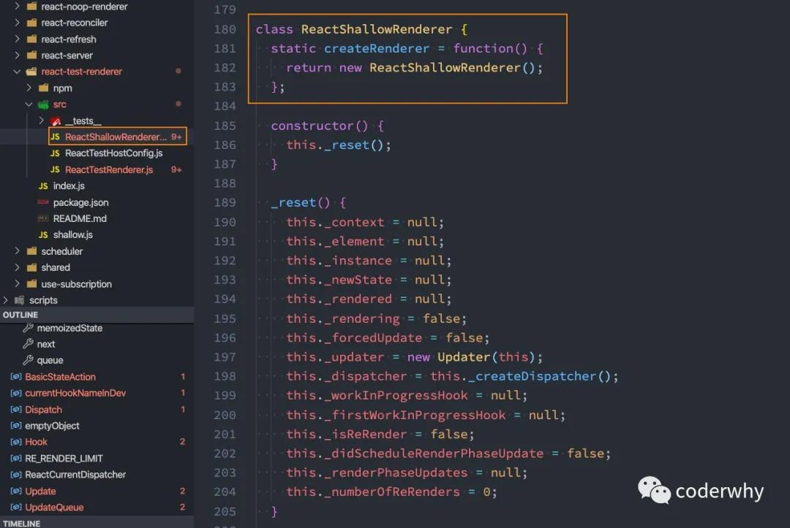
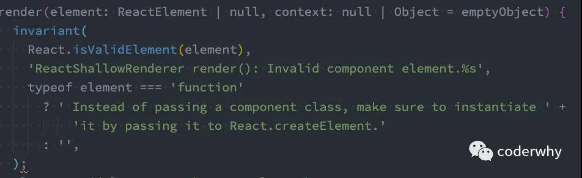
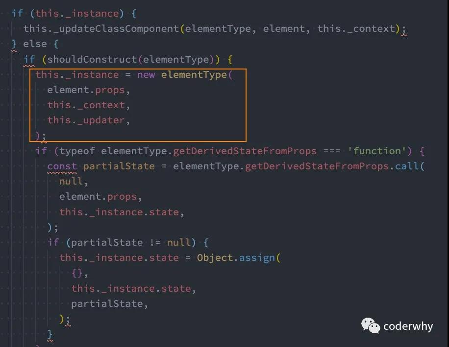
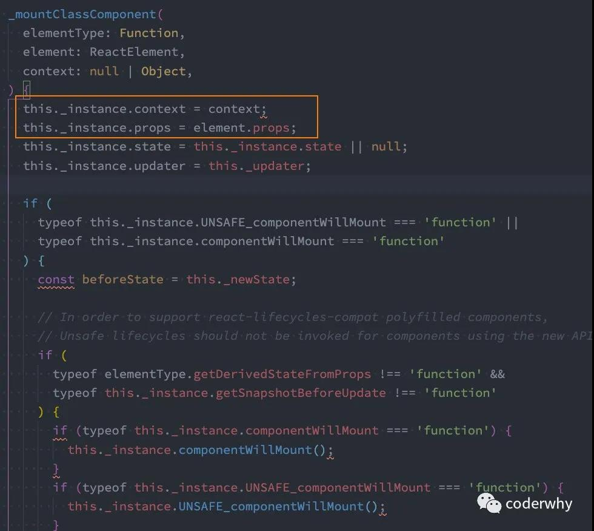

## 认识组件化开发
- 什么是组件化？
人面对复杂问题的处理方式：
  + 任何一个人处理信息的逻辑能力都是有限的
  + 所以，当面对一个非常复杂的问题时，我们不太可能一次性搞定一大堆的内容。
  + 但是，我们人有一种天生的能力，就是将问题进行拆解。
  + 如果将一个复杂的问题，拆分成很多个可以处理的小问题，再将其放在整体当中，你会发现大的问题也会迎刃而解。

组件化也是类似的思想：
  + 如果我们将一个页面中所有的处理逻辑全部放在一起，处理起来就会变得非常复杂，而且不利于后续的管理以及扩展。
  + 但如果，我们讲一个页面拆分成一个个小的功能块，每个功能块完成属于自己这部分独立的功能，那么之后整个页面的管理和维护就变得非常容易了。

我们需要通过组件化的思想来思考整个应用程序：
  + 我们将一个完整的页面分成很多个组件；
  + 每个组件都用于实现页面的一个功能块；
  + 而每一个组件又可以进行细分；
  + 而组件本身又可以在多个地方进行复用；

- React的组件化
组件化是React的核心思想，也是我们后续课程的重点，前面我们封装的App本身就是一个组件：
  + 组件化提供了一种抽象，让我们可以开发出一个个独立可复用的小组件来构造我们的应用。
  + 任何的应用都会被抽象成一颗组件树。

组件化思想的应用：
  + 有了组件化的思想，我们在之后的开发中就要充分的利用它。
  + 尽可能的将页面拆分成一个个小的、可复用的组件。
  + 这样让我们的代码更加方便组织和管理，并且扩展性也更强。

React的组件相对于Vue更加的灵活和多样，按照不同的方式可以分成很多类组件：
  + **根据组件的定义方式**：可以分为：函数式组件（Functional Component）和类组件（Class Component）
  + **根据组件内部是否有状态需要维护**：可以分为：无状态组件（Stateless Component）和有状态组件（Stateful Component）
  + **根据组件不同的职责**：可以分为：展示型组件（Presentational Component）和容器型组件（Container Component）

这些概念有很多重叠，但是他们最主要是**关注数据逻辑和UI展示的分离**：
  + 函数组件、无状态组件、展示型组件主要关注UI的展示；
  + 类组件、有状态组件、容器型组件主要关注数据逻辑；

当然还有很多组件的其他概念：比如异步组件、高阶组件等，我们后续再学习。

## React 创建组件
### 创建类组件
- 类组件的定义有如下要求：
  + 必须继承自 React.Component
  + 必须实现 render 函数

- 在 ES6 之前，可以通过 create-react-class 模块来定义类组件，但是目前官网建议我们使用 ES6 的 class 类来定义组件

- 使用 class 定义一个组件
  + constructor 是可选的，我们通常在constructor 中初始化一些数据
  + this.state 中维护的就是我们组件内部的数据
  + render() 方法是 class 组件中唯一必须实现的方法
  ```jsx
    import React, { Component } from 'react';

    export default class App extends Component {
      constructor() {
        super();
        this.state = {
          
        }
      }

      render() {
        return <h2>Hello App</h2>
      }
    }
  ```
  
  当 render 被调用时，它会检查 this.props 和 this.state 的变化并返回以下类型之一
  + React 元素
    - 通常通过 jsx 创建
    - 例如，<div /> 会被 React 渲染为 DOM 节点，<MyComponent /> 会被 React 渲染为自定义组件；
    - 无论是 <div /> 还是 <MyComponent /> 均为 React 元素。
  + 数组或 fragments：使得 render 方法可以返回多个元素
  + Portals：可以渲染子节点到不同的 DOM 子树中
  + 字符串或数字类型：它们在 DOM 中被渲染为文本节点
  布尔类型或 null：什么都不渲染
  另外类组件有自己的生命周期

### 创建函数式组件
- 函数组件是使用 function 定义的组件，只是这个函数会返回和类组件中 render 函数返回一样的内容
- 函数组件有自己的特点：
  + 没有生命周期
  + 没有this（组件实例）
  + 没有内部状态（state）
- 下面是如何定义函数组件：
  ```jsx
    export default function App() {
      return (
        <div>hello world</div>
      )
    }
  ```

## 组件的生命周期
### 认识生命周期
- 很多的事物都有从创建到销毁的整个过程，这个过程称之为是生命周期；

- React组件也有自己的生命周期，了解组件的生命周期可以让我们在最合适的地方完成自己想要的功能；

- 生命周期和生命周期函数的关系：
  + 生命周期是一个抽象的概念，在生命周期的整个过程，分成了很多个阶段；
    - 比如装载阶段（Mount），组件第一次在DOM树中被渲染的过程；
    - 比如更新过程（Update），组件状态发生变化，重新更新渲染的过程；
    - 比如卸载过程（Unmount），组件从DOM树中被移除的过程；

  + React内部为了告诉我们当前处于哪些阶段，会对我们组件内部实现的某些函数进行回调，这些函数就是生命周期函数：
    - 比如实现componentDidMount函数：组件已经挂载到DOM上时，就会回调；
    - 比如实现componentDidUpdate函数：组件已经发生了更新时，就会回调；
    - 比如实现componentWillUnmount函数：组件即将被移除时，就会回调；
    - 我们可以在这些回调函数中编写自己的逻辑代码，来完成自己的需求功能；

- 我们谈React生命周期时，主要谈的类的生命周期，因为函数式组件是没有生命周期函数的；（后面我们可以通过hooks来模拟一些生命周期的回调）

### 生命周期解析
- componentDidMount：
  + 当我们挂载一个组件时，会先执行constructor构造方法来创建组件；
  + 紧接着调用render函数，获取要渲染的DOM结构（jsx），并且开始渲染DOM；
  + 当组件挂载成功（DOM渲染完成），会执行componentDidMount生命周期函数；

- componentDidUpdate
  + 当我们通过修改props，或者调用setState修改内部状态，或者直接调用forceUpdate时会重新调用render函数，进行更新操作；
  + 当更新完成时，会回调componentDidUpdate生命周期函数；

- componentWillUnmount
  + 当我们的组件不再使用，会被从DOM中移除掉（卸载）；
  + 这个时候会回调componentWillUnmount生命周期函数；

### 生命周期函数
- constructor：`constructor(props)`
  + 如果不初始化 state 或不进行方法绑定，则不需要为 React 组件实现构造函数。
  + constructor中通常只做两件事情：
    1. 通过给 this.state 赋值对象来初始化内部的state；
    2. 为事件绑定实例（this）；

- componentDidMount: `componentDidMount()`
  + componentDidMount() 会在组件挂载后（插入 DOM 树中）立即调用。
  + componentDidMount中通常进行哪些操作呢？
    1. 依赖于DOM的操作可以在这里进行；
    2. 在此处发送网络请求就最好的地方；（官方建议）
    3. 可以在此处添加一些订阅（会在componentWillUnmount取消订阅）；

- componentDidUpdate: `componentDidUpdate(prevProps, prevState, snapshot)`
  + componentDidUpdate() 会在更新后会被立即调用，首次渲染不会执行此方法。
  + 当组件更新后，可以在此处对 DOM 进行操作；
  + 如果你对更新前后的 props 进行了比较，也可以选择在此处进行网络请求；（例如，当 props 未发生变化时，则不会执行网络请求）。
  ```js
    componentDidUpdate(prevProps) {
      // 典型用法（不要忘记比较 props）：
      if(this.props.userID !== prevProps.userID) {
        this.fetchData(this.props.userID);
      }
    }
  ```

- componentWillUnmount: `componentWillUnmount()`
  + componentWillUnmount() 会在组件卸载及销毁之前直接调用。
  + 在此方法中执行必要的清理操作；
  + 例如，清除 timer，取消网络请求或清除在 componentDidMount() 中创建的订阅等；

- 代码验证
  ```jsx
  import React, { Component } from 'react'

  class MyComponent extends Component {
    constructor(props) {
      super(props)
      console.log('MyComponent constructor')
    }

    render() {
      console.log('MyComponent render')
      return <h2>MyComponent</h2>
    }

    componentDidMount() {
      console.log('MyComponent componentDidMount')
    }

    componentDidUpdate() {
      console.log('MyComponent componentDidUpdate')
    }

    componentWillUnmount() {
      console.log('MyComponent componentWillUnmount')
    }
  }


  class App extends Component {
    constructor(props) {
      super(props)
      this.state = {
        count: 0
      }
      console.log('App constructor')
    }

    render() {
      console.log('App render')
      return (
        <div>
          <h2>当前计数： {this.state.count}</h2>
          {this.state.count <= 5 && <MyComponent/>}
          <button onClick={e => this.btnClick()}>+1</button>
        </div>
      )
    } 

    btnClick() {
      this.setState({
        count: this.state.count + 1
      })
    }

    componentDidMount() {
      console.log('App componentDidMount')
    }

    componentDidUpdate() {
      console.log('App componentDidUpdate')
    }

    componentWillUnmount() {
      console.log('App componentWillUnmount')
    }
  }

  export default App;
  ```

- 不常用生命周期
除了上面介绍的生命周期函数之外，还有一些不常用的生命周期函数：
  + getDerivedStateFromProps：state 的值在任何时候都依赖于 props时使用；该方法返回一个对象来更新state；
  + getSnapshotBeforeUpdate：在React更新DOM之前回调的一个函数，可以获取DOM更新前的一些信息（比如说滚动位置）；
  + shouldComponentUpdate：该生命周期函数很常用，但是我们等待讲性能优化时再来详细讲解； 


## 父子组件通信
### 认识组件的嵌套
组件之间存在嵌套关系：

- 在之前的案例中，我们只是创建了一个组件App；
- 如果我们一个应用程序将所有的逻辑都放在一个组件中，那么这个组件就会变成非常的臃肿和难以维护；
- 所以组件化的核心思想应该是对组件进行拆分，拆分成一个个小的组件；
- 再将这些组件组合嵌套在一起，最终形成我们的应用程序；
我们来分析一下下面代码的嵌套逻辑：
```jsx
  function Header() {
    return (
      <h2>Header</h2>
    )
  }

  function Main() {
    return (
      <div>
        <Banner/>
        <ProductList/>  
      </div>
    )
  }

  function Banner() {
    return <div>Banner</div>
  }

  function ProductList() {
    return (
      <ul>
        <li>商品1</li>
        <li>商品2</li>
        <li>商品3</li>
        <li>商品4</li>
        <li>商品5</li>
      </ul>
    )
  }

  function Footer() {
    return <h2>Footer</h2>
  }

  class App extends React.Component {

    render() {
      return(
        <div>
          <Header />
          <Main/>
          <Footer/>
        </div>
      )
    }
  }

  ReactDOM.render(<App/>, document.getElementById('app'))
```
上面的嵌套关系如下：
  - App 组件是 Header、Main、Footer组件的父组件
  - Main 组件是 Banner、ProductList组件的父组件

在开发过程中，我们会经常遇到需要组件之间相互进行通信：
  - 比如App可能使用了多个Header，每个地方的Header展示的内容不同，那么我们就需要使用者传递给Header一些数据，让其进行展示；
  - 又比如我们在Main中一次性请求了Banner数据和ProductList数据，那么就需要传递给他们来进行展示；
  - 也可能是子组件中发生了事件，需要由父组件来完成某些操作，那就需要子组件向父组件传递事件；

父组件在展示子组件，可能会传递一些数据给子组件：
  - 父组件通过 属性=值 的形式来传递给子组件数据；
  - 子组件通过 props 参数获取父组件传递过来的数据；

### 父组件传递子组件
1. 子组件是 class 组件
我们这里先演示子组件是class组件：
```jsx
  class ChildCpn1 extends React.Component {
    constructor(props) {
      super()
      this.props = props
    }

    render() {
      const {name, age, height} = this.props

      return (
        <div>
          <h2>我是class子组件</h2>  
          <p>展示父组件传递过来的数据：{name} {age} {height}</p>
        </div>
      )
    }
  }

  class App extends React.Component {
    render() {
      return(
        <div>
          <ChildCpn1 name="pipi1ei" age="18" height="180" />
        </div>
      )
    }
  }
```
按照上面的结构，我们每个子组件都需要写一个构造器来完成：`this.props = props`，其实可以不用这样，我们可以调用 `super(props)`，我们来看一下 Component 的源码：
```js
  function Component(props, context, updater) {
    this.props = props;
    this.context = context;
    // If a component has string refs, we will assign a different object later.
    this.refs = emptyObject;
     // We initialize the default updater but the real one gets injected by the renderer.
    this.updater = updater;
  }
```
  - 这里我们先不关心 context，updater，我们发现传入的 props 会被设置到this中（父类的对象），那么子类就可以继承过来

所以我们的构造方法可以换成下面的写法：
```js
  constructor(props) {
    super(props);
  }
```

甚至可以省略，因为如果不指定构造方法，则使用默认的构造函数，对于基类，默认构造函数是：
```js
  constructor() {}
```

对于派生类，默认构造函数是：
```js
  constructor(...args) {
    super(...args);
  }
```

2. 子组件是 function 组件
```jsx
  function ChildCpn2(props) {
    const {name, age, height} = props

    return (
      <div>
        <h2>我是function类型的子组件</h2>  
        <p>展示父组件传递过来的数据：{name} {age} {height}</p>
      </div>
    )
  }

  class App extends React.Component {
    render() {
      return(
        <div>
          <ChildCpn2 name="why" age="18" height="1.88"/>
          <ChildCpn2 name="kobe" age="30" height="1.98"/>
        </div>
      )
    }
  }
```
functional组件相对来说比较简单，因为不需要有构造方法，也不需要有this的问题。

3. 参数验证 propTypes
对于传递给子组件的数据，有时候我们可能希望进行验证，特别是对于大型项目来说：
  - 当然，如果项目中默认继承了 Flow 或 TypeScript，那么就可以直接进行类型验证
  - 但是，即使我们没有使用 Flow 或 Typescript，也可以通过 **prop-types** 库来进行参数验证

从 React v15.5 开始，React.PropTypes已移入另一个包中：prop-types 库
我们对之前的class组件进行验证：
```js
ChildCpn1.propTypes = {
  name: PropTypes.string,
  age: PropTypes.number,
  height: PropTypes.number
}
```
这时候，控制台就会报出警告

如果没有传递参数，我们希望有默认值可以使用 defaultProps
```js
ChildCpn1.defaultProps = {
  name: "王小波",
  age: 40,
  height: 1.92
}
```

### 子组件传递父组件
某些情况，我们也需要子组件向父组件传递消息：
  - 在vue中是通过自定义事件来完成的；
  - 在React中同样是通过props传递消息，只是让父组件给子组件传递一个回调函数，在子组件中调用这个函数即可；

我们这里来完成一个案例：
  - 将计数器案例进行拆解；
  - 将按钮封装到子组件中：CounterButton；
  - CounterButton发生点击事件，将内容传递到父组件中，修改counter的值；

```jsx
  function CounterButton(props) {
    const {operator, btnClick} = props
    return <button onClick={btnClick}>{operator}</button>
  }

  class App extends React.Component {
    constructor(props) {
      super(props)
      this.state = {
        counter: 0
      }
    }

    render() {
      return(
        <div>
          <h2>当前计数：{this.state.counter}</h2>
          <CounterButton operator="+1" btnClick={e => this.changeCounter(1)} />
          <CounterButton operator="-1" btnClick={e => this.changeCounter(-1)} />
        </div>
      )
    }

    changeCounter(count) {
      this.setState({
        counter: this.state.counter + count
      })
    }
  }
```

### 组件通信练习
- 详见：./04_react组件化/04-component-communicate-demo

### React 插槽的实现
1. 为什么使用插槽？
在开发中，我们抽取了一个组件，但是为了让这个组件具备更强的通用性，我们不能将组件中的内容限制为固定的div、span等等这些元素。
我们应该让使用者可以决定某一块区域到底存放什么内容。
举个栗子：假如我们定制一个通用的导航组件 - NavBar
  - 这个组件分成三块区域：左边-中间-右边，每块区域的内容是不固定；
  - 左边区域可能显示一个菜单图标，也可能显示一个返回按钮，可能什么都不显示；
  - 中间区域可能显示一个搜索框，也可能是一个列表，也可能是一个标题，等等；
  - 右边可能是一个文字，也可能是一个图标，也可能什么都不显示；

这种需求在Vue当中有一个固定的做法是通过slot来完成的，React呢？
  - React对于这种需要插槽的情况非常灵活；
  - 有两种方案可以实现：children和props；

- 详见：./04_react组件化/05-react-slot


## 非父子组件通信
### Context 的使用
1. Context应用场景
非父子组件数据的共享：
- 在开发中，比较常见的数据传递方式是通过 props 属性自上而下（由父到子）进行传递
- 但对于有些场景，比如一些数据需要在多个组件之间进行共享（地区偏好、UI主题、用户登录状态等），如果我们在顶层的 App 中定义这些信息，之后一层层传递下去，那么对于一些中间层不需要的组件来说，是一种冗余的操作

```jsx
import React, { Component } from 'react'

function ProfileHeader(props) {
  return (
    <div>
      <h2>用户名：{props.nickname}</h2>
      <h2>用户等级：{props.level}</h2>
    </div>
  )
}

class Profile extends Component {
  render() {
    return (
      <div>
        <ProfileHeader nickname={this.props.nickname} level={this.props.level} />
        <ul>
          <li>设置1</li>
          <li>设置2</li>
          <li>设置3</li>
          <li>设置4</li>
          <li>设置5</li>
        </ul>
      </div>
    )
  }
}

class App extends Component {
  constructor(props) {
    super(props)
    this.state = {
      nickname: 'pipilei',
      level: 99
    }
  }

  render() {
    const { nickname, level } = this.state

    return (
      <div>
        <Profile nickname={nickname} level={level} />
        <h2>其他内容</h2>
      </div>
    )
  }
}
```

+ 补充个小知识点：Spread Attributes
下面两种写法是等价的：
```jsx
  function App1() {
    return <Greeting firstName="Ben" lastName="Hector" />
  }

  function App2() {
    const props = { firstName: "Ben", lastName: "Hector" }
    return <Greeting {...props} />
  }
```

那么我们上面的Profile的传递代码可以修改为如下代码：
```jsx
  <ProfileHeader {...this.props}/>
```

但是，如果层级更多的话，一层层传递是非常麻烦，并且代码是非常冗余的：
  - react 提供了一个API：Context
  - Context 提供了一种在组件之间共享此类值的方式，而不必显示地通过组件树的逐层传递props
  - Context 设计目的是为了共享那些对于一个组件树而言是“全局”的数据，例如当前用户的登陆状态

2. Context 相关API
- React.createContext
  ```jsx
  const MyContext = React.createContext(defaultValue)
  ```
  + 创建一个需要共享的 Context 对象：
    - 如果一个组件订阅了 Context，那么这个组件会从离自身最近的那个匹配的 Provider 中读取到当前 Context 的值
    - defaultValue 是组件在顶层查找过程中没有找到对应的 Provider，那么就使用默认值

- Context.Provider
  ```jsx
    <MyContext.Provider value={/* 某个值 */}>
  ```
  + 每个Context对象都会返回一个Provider React 组件，它允许消费组件订阅 Context 的变化
    - Provider 接收一个value属性，传递给消费组件
    - 一个 Provider 可以和多个消费组件有对应关系
    - 多个 Provider 也可以嵌套使用，里面的会覆盖外层数据
  当Provider value 的值发生变化时，它内部的所有消费组件都会重新渲染

- Class.contextType
  ```jsx
    class MyClass extends React.Component {
      componentDidMount() {
        let value = this.context;
        /* 在组件挂载完成后，使用 MyContext 组件的值来执行一些有副作用的操作 */
      }
      componentDidUpdate() {
        let value = this.context;
        /* ... */
      }
      componentWillUnmount() {
        let value = this.context;
        /* ... */
      }
      render() {
        let value = this.context;
        /* 基于 MyContext 组件的值进行渲染 */
      }
    }
    MyClass.contextType = MyContext;
  ```
  挂载在 class 上的 contextType 属性会被重赋值为一个由 React.createContext() 创建的 Context 对象：
    + 这能让你使用 this.context 来消费最近 Context 上的那个值；
    + 你可以在任何生命周期中访问到它，包括 render 函数中；

- Context.Consumer
  ```jsx
    <MyContext.Consumer>
      {value => /* 基于 context 值进行渲染 */}
    </MyContext.Consumer>
  ```
  这里，React 组件也可以订阅到 context 变更。这能让你在 函数式组件 中完成订阅 context。
    + 这里需要 函数作为子元素（function as child）这种做法；
    + 这个函数接收当前的 context 值，返回一个 React 节点；

3. Context 的使用过程
  ```jsx
  import React, { Component } from 'react'

  const userContext = React.createContext({nickname: '默认', level: 0})

  class ProfileHeader extends Component {
    render() {
      return (
        <div>
          <h2>用户昵称：{this.context.nickname}</h2>
          <h2>用户等级：{this.context.level}</h2>
        </div>
      )
    }
  }
  ProfileHeader.contextType = userContext;

  class Profile extends Component {
    render() {
      return (
        <div>
          <ProfileHeader />
          <ul>
            <li>设置1</li>  
            <li>设置2</li>  
            <li>设置3</li>  
            <li>设置4</li>  
            <li>设置5</li>  
          </ul>
        </div>
      )
    }
  }

  export default class App extends Component {
    render() {
      return (
        <div>
          <userContext.Provider value={{nickname: 'pipilei', level: 99}}>
            <Profile />
          </userContext.Provider>
          <h2>其他内容</h2>
        </div>
      )
    }
  };
  ```

  - 什么时候使用 defaultValue 呢？如果出现了如下代码：
    + <Profile />并没有作为 UserContext.Provider 的子组件；
    ```jsx
      <Profile />
      <userContext.Provider value={{nickname: 'pipilei', level: 99}}>
      </userContext.Provider>
    ```

  - 什么时候使用 Consumer 呢？
    + 1.当使用value的组件是一个函数式组件时；
    + 2.当组件中需要使用多个Context时；
    演练一：
    ```jsx
      function ProfileHeader() {
        return (
          <div>
            <UserContext.Consumer>
              {
                value => {
                  return (
                    <div>
                      <h2>用户昵称：{value.nickname}</h2>
                      <h2>用户等级：{value.level}</h2>
                    </div>
                  )
                }
              }
            </UserContext.Consumer>
          </div>
        )
      }
    ```

    演练二：
    1. 创建一个新的 Context
    ```jsx
      const ThemeContext = React.createContext({ color: "black" });
    ```

    2. Provider的嵌套
    ```jsx
      <UserContext.Provider value={{ nickname: "why", level: 99 }}>
        <ThemeContext.Provider value={{color: "red"}}>
          <Profile />
        </ThemeContext.Provider>
      </UserContext.Provider>
    ```

    3. 使用Consumer的嵌套
    ```jsx
      <UserContext.Consumer>
        {value => {
          return (
            <ThemeContext.Consumer>
              {
                theme => (
                  <div>
                    <h2 style={theme}>用户昵称: {value.nickname}</h2>
                    <h2 style={theme}>用户等级: {value.level}</h2>
                  </div>
                )
              }
            </ThemeContext.Consumer>
          )
        }}
      </UserContext.Consumer>
    ```


### 事件总线
前面通过Context主要实现的是数据的共享，但是在开发中如果有跨组件之间的事件传递，应该如何操作呢？
  - 在Vue中我们可以通过Vue的实例，快速实现一个事件总线（EventBus），来完成操作；
  - 在React中，我们可以依赖一个使用较多的库 events 来完成对应的操作；

我们可以通过npm或者yarn来安装events：`yarn add events;`

events常用的API：
  - 创建 EventEmit 对象：eventBus 对象
  - 发出事件：eventBus.emit("事件名称", 参数列表)
  - 监听事件：eventBus.addListener("事件名称", 监听函数)
  - 移除事件：eventBus.removeListener("事件名称", 监听函数)

- 案例练习
```jsx
import React, { Component } from 'react';
import { EventEmitter } from "events";

const eventBus = new EventEmitter();

class ProfileHeader extends Component {
  render() {
    return (
      <div>
        <button onClick={e => this.btnClick()}>按钮</button>
      </div>
    )
  }

  btnClick() {
    eventBus.emit("headerClick", "why", 18);
  }
}


class Profile extends Component {
  render() {
    return (
      <div>
        <ProfileHeader />
        <ul>
          <li>设置1</li>
          <li>设置2</li>
          <li>设置3</li>
          <li>设置4</li>
          <li>设置5</li>
        </ul>
      </div>
    )
  }
}

export default class App extends Component {

  componentDidMount() {
    eventBus.addListener("headerClick", this.headerClick)
  }

  headerClick(name, age) {
    console.log(name, age);
  }

  componentWillUnmount() {
    eventBus.removeListener("headerClick", this.headerClick);
  }

  render() {
    return (
      <div>
        <Profile/>
        <h2>其他内容</h2>
      </div>
    )
  }
}
```

### 临时知识补充
在进行React开发中，有一个很奇怪的现象：
  - 在调用super()的时候，我没有传入props，但是在下面的render函数中我依然可以使用；
  - 如果你自己编写一个基础的类，可以尝试一下：这种情况props应该是undefined的；
  ```jsx
    class ChildCpn extends Component {
      constructor(props) {
        super();
      }

      render() {
        const {name, age, height} = this.props;
        return (
          <h2>子组件展示数据: {name + " " + age + " " + height}</h2>
        )
      }
    }
  ```
为什么这么神奇呢？
  - 之所以可以，恰恰是因为React担心你的代码会出现上面这种写法而进行了一些 骚操作；
  - React不管你有没有通过super将props设置到当前的对象中，它都会重新给你设置一遍；

如何验证呢？
  - 这就需要通过源码来验证了；
  - React的源码packages中有提供一个Test Renderer的package；
  - 这个 package 提供了一个 React 渲染器，用于将 React 组件渲染成纯 JavaScript 对象，不需要依赖 DOM 或原生移动环境；

查看源码：

我们来看一下这个组件是怎么被创建出来的：
  - 我们找到其中的render函数；
  
  - render函数中有这样的一段代码；
    + 这个_instance实例就是组件对象；
  
  - 我们再看一下，它在哪里重新赋值的：
    + 这里还包括通过this._instance的方式回调生命周期函数；
  

## 受控组件和非受控组件
### refs 的使用
在 react 开发模式中，通常情况下不需要、也不建议直接操作原生DOM，但是某些特殊的情况，确实需要获取到DOM进行操作
  - 管理焦点，文本选择或媒体播放
  - 触发强制动画
  - 继承第三番DOM库

1. 创建 ref 的方式
如何创建refs来获取对应的DOM呢？目前有三种方式：
  - 方式一：传入字符串
    + 使用时通过 `this.refs.传入的字符串` 格式获取对应的元素
  - 方式二：传入一个对象
    + 对象是通过 React.createRef() 方式创建出来的
    + 使用时获取到创建的对象其中有一个 current 属性就是对应的元素
  - 方式三：传入一个函数
    + 该函数会在DOM被挂载的时候回调，这个函数会传入一个对象，我们可以自己保存
    + 使用时，直接拿到之前保存的对象即可

  代码演练：
  ```jsx
    import React, { PureComponent, createRef } from 'react'

    export default class App extends PureComponent {
      constructor(props) {
        super(props);

        this.titleRef = createRef();
        this.titleEl = null;
      }

      render() {
        return (
          <div>
            <h2 ref="title">String Ref</h2>
            <h2 ref={this.titleRef}>Hello Create Ref</h2>
            <h2 ref={element => this.titleEl = element}>Callback Ref</h2>

            <button onClick={e = this.changeText()}>改变文本</button>
          </div>
        )
      }

      changeText() {
        this.refs.title.innerHTML = '你好啊，李银河'
        this.titleRef.current.innerHTML = '你好啊，李银河'
        this.titleEl.innerHTML = '你好啊，李银河'
      }
    }
  ```

2. ref 节点的类型
ref 的值根据节点的类型而有所不同：
- 当 ref 属性用于HTML元素时，构造函数使用 React.createRef() 创建的 ref 接受底层DOM元素作为其 current 属性
- 当 ref 属性用在自定义 class 组件时，ref对象接收组件的挂载实例作为其current属性
- 你不能在函数组件上使用 ref 属性，因为他们没有实例；

这里我们演示一下ref引用一个class组件对象：
```jsx
import React, { PureComponent, createRef } from 'react'

class Counter extends PureComponent {
  constructor(props) {
    super(props)

    this.state = {
      counter: 0
    }
  }

  render() {
    return (
      <div>
        <h2>当前计数： {this.state.counter}</h2>
        <button onClick={e => this.increment()}>+1</button>
      </div>
    )
  }

  increment() {
    this.setState({
      counter: this.state.counter + 1
    })
  }
}

export class App extends PureComponent {
  constructor(props) {
    super(props)

    this.counterRef = createRef()
  }

  render() {
    return(
      <div>
        <Counter ref={this.counterRef} />
        <button onClick={e => this.increment()}>App+1</button>
      </div>
    )
  }

  increment() {
    this.counterRef.current.increment()
  }
}
```

### 受控组件
1. 认识受控组件
- 默认提交表单方式
在React中，HTML表单的处理方式和普通的DOM元素不太一样：表单元素通常会保存在一些内部的state。
比如下面的HTML表单元素：
  + 这个处理方式是DOM默认处理HTML表单的行为，在用户点击提交时会提交到某个服务器中，并且刷新页面；
  + 在React中，并没有禁止这个行为，它依然是有效的；
  + 但是通常情况下会使用JavaScript函数来方便的处理表单提交，同时还可以访问用户填写的表单数据；
  + 实现这种效果的标准方式是使用“受控组件”；
  ```html
    <form>
      <label>
        名字：
        <input type="text" name="name" />
      </label>
      <input type="submit" value="提交" />
    </form>
  ```

- 受控组件提交表单
在 HTML 中，表单元素（如<input>、 <textarea> 和 <select>）之类的表单元素通常自己维护 state，并根据用户输入进行更新。
而在 React 中，可变状态（mutable state）通常保存在组件的 state 属性中，并且只能通过使用 setState()来更新。
  + 我们将两者结合起来，使React的state成为“唯一数据源”；
  + 渲染表单的 React 组件还控制着用户输入过程中表单发生的操作；
  + 被 React 以这种方式控制取值的表单输入元素就叫做“受控组件”；

  例如，如果我们想让前一个示例在提交时打印出名称，我们可以将表单写为受控组件：
  ```jsx
    import React, { PureComponent } from 'react'

    export default class App extends PureComponent {
      constructor(props) {
        super(props);

        this.state = {
          username: ""
        }
      }

      render() {
        const { username } = this.state

        return (
          <div>
            <form onSubmit={e => this.handleSubmit()}>
              <label>
                用户名：
                <input type="text" id="username" value={username} onChange={e => this.handleUsernameChange()} />
              </label>
              <input type="submit" value="提交"/>
            </form>
          </div>
        )
      }

      handleUsernameChange(e) {
        this.setState({
          username: e.target.value
        })
      }

      handleSubmit(e) {
        console.log(this.username)
        e.preventDefault()
      }
    }
  ```
  由于在表单元素上设置了 value 属性，因此显示的值将始终为 this.state.value，这使得 React 的 state 成为唯一数据源。
  由于 handleUsernameChange 在每次按键时都会执行并更新 React 的 state，因此显示的值将随着用户输入而更新。


### 非受控组件
React推荐大多数情况下使用 受控组件 来处理表单数据：
  + 一个受控组件中，表单数据是由 React 组件来管理的；
  + 另一种替代方案是使用非受控组件，这时表单数据将交由 DOM 节点来处理；
如果要使用非受控组件中的数据，那么我们需要使用 ref 来从DOM节点中获取表单数据。

我们来进行一个简单的演练：
  + 使用ref来获取input元素；
  + 在非受控组件中通常使用defaultValue来设置默认值；

```jsx
import React, { PureComponent, createRef } from 'react'

export default class App extends PureComponent {
  constructor(props) {
    super(props);

    this.usernameRef = createRef();
  }

  render() {
    return (
      <div>
        <form onSubmit={e => this.handleSubmit(e)}>
          <label htmlFor="">
            用户:<input defaultValue="username" type="text" name="username" ref={this.usernameRef}/>
          </label>
          <input type="submit" value="提交"/>
        </form>
      </div>
    )
  }

  handleSubmit(event) {
    event.preventDefault();
    console.log(this.usernameRef.current.value);
  }
}
```
- 同样，<input type="checkbox"> 和 <input type="radio"> 支持 defaultChecked，<select> 和 <textarea> 支持 defaultValue。


## 高阶组件和组件补充
### 高阶组件
- 认识高阶组件
在认识高阶组件之前，先了解一下高阶函数，高阶函数的维基百科定义如下
  + 接受一个或多个函数作为输入
  + 输出一个函数
JavaScript中比较常见的filter、map、reduce都是高阶函数。

高阶组件是什么呢？
  + 高阶组件的英文是：Higher-Order Components， 简称HOC
  + 官方的定义：**高阶组件是参数为组件，返回值为新的组件的函数**

我们可以进行如下的解析：
  + 首先， 高阶组件 本身不是一个组件，而是一个函数；
  + 其次，这个函数的参数是一个组件，返回值也是一个组件；

高阶组件的调用过程类似于这样：
```js
  const EnhancedComponent = higherOrderComponent(WrappedComponent)
```

高阶组件的编写过程类似于这样
```jsx
function higherOrderComponent(WrappedComponent) {
  return class NewComponent extends PureComponent {
    render() {
      return <WrappedComponent />
    }
  }
}
```

在ES6中，类表达式中类名是可以省略的，所以可以可以写成下面的写法：
```jsx
function higherOrderComponent(WrapperComponent) {
  return class extends PureComponent {
    render() {
      return <WrapperComponent/>
    }
  }
}
```
另外，组件的名称都可以通过displayName来修改：
```jsx
function higherOrderComponent(WrapperComponent) {
  class NewComponent extends PureComponnet {
    render() {
      return <WrapperComponent/>
    }
  }
  NewComponent.displayName = 'pipilei'
  return NewComponent
}
```

完整代码如下：
```jsx
import React, { PureComponent } from 'react'

function higherOrderComponent(WrapperComponent) {
  return class NewComponent extends PureComponent {
    render() {
      return <WrapperComponent/>
    }
  }
}

class App extends PureComponent {
  render() {
    return (
      <div>
        App
      </div>
    )
  }
}

export default higherOrderComponent(App)
```
高阶组件并不是React API的一部分，它是基于React的组合特性而形成的设计模式；
高阶组件在一些React第三方库中非常常见：
  + 比如 redux 中的 connect
  + 比如 react-router 中的 WithRouter


- 高阶组件的使用
1. props 增强
```jsx
import React, { PureComponent } from 'react'

class Header extends PureComponent {
  render() {
    const { name, age, height } = this.props

    return <h2>Header { name + age + height }</h2>
  }
}

function enhanceProps(WrappedCpn, otherProps) {
  return props => <WrappedCpn {...props} {...otherProps} />
}

const EnhanceHeader = enhanceProps(Header, { height: 188 });

export default class App extends PureComponent {
  render() {
    return (
      <div>
        <EnhanceHeader name="pipilei" age="18" />
      </div>
    );
  }
  
}
```

2. 利用高阶组件来共享 Context
```jsx
import React, { PureComponent, createContext } from 'react'

const UserContext = createContext({
  nickname: '默认',
  level: -1
})

function WithUser(WrappedCpn) {
  return props => {
    return (
      <UserContext.Consumer>
        {
          value => {
            return <WrappedCpn {...props} {...value} />
          }
        }
      </UserContext.Consumer>
    )
  }
}

function Header(props) {
  const { nickname, level } = props;
  return <h2>Header 昵称：{nickname}, 等级： {level}</h2>
}

function Footer(props) {
  const { nickname, level } = props;
  return <h2>Footer 昵称：{nickname}, 等级： {level}</h2>
}

const UserHeader = WithUser(Header);
const UserFooter = WithUser(Footer);

export default class App extends PureComponent {
  render() {
    return (
      <div>
        <UserContext.Provider value={{ nickname: 'pipilei', level: 99 }}>
          <UserHeader />  
          <UserFooter />
        </UserContext.Provider>
      </div>
    )
  }
}
```

3. 渲染判断鉴权
在开发中，我们可能遇到这样的场景
  - 某些页面是必须用户登录成功才能进行进入
  - 如果用户没有登录成功，那么直接跳转到登陆页面

这个时候，我们就可以使用高阶组件来完成鉴权操作
```jsx
import React, { PureComponent } from 'react'

function LoginPage() {
  return <h2>LoginPage</h2>
}

function CartPage() {
  return <h2>CartPage</h2>
}

function authentication(Page) {
  return props => {
    if(props.isLogin) {
      return <Page />
    } else {
      return <LoginPage />
    }
  }
}

const AuthCart = authentication(CartPage)

export default class App extends PureComponent {
  render() {
    return (
      <div>
        <AuthCart isLogin={true} />
      </div>
    )
  }
}
```

4. 声明周期劫持
```jsx
import React, { PureComponent } from 'react'

class Home extends PureComponent {
  render() {
    return (
      <div>
        <h2>Home</h2>
        <p>我是Home的元素</p>
      </div>
    )
  }
}

class Detail extends PureComponent {
  render() {
    return (
      <div>
        <h2>我是Detail的元素</h2>
        <p>我是我是Detail的元素的元素</p>
      </div>
    )
  }
}

function logRenderTime(WrappedCpn) {
  return class extends PureComponent {
    UNSAFE_componentWillMount() {
      this.begin = Date.now()
    }
  
    componentDidMount() {
      this.displayName = WrappedCpn.name
      this.end = Date.now()
      const interval = this.end - this.begin;
      console.log(`${this.displayName}渲染使用时间:${interval}`)
    }

    render() {
      return <WrappedCpn {...this.props} />
    }
  }
}

const LogHome = logRenderTime(Home)
const LogDetail = logRenderTime(Detail)

export default class App extends PureComponent {
  render() {
    return (
      <div>
        <LogHome />
        <LogDetail />
      </div>
    )
  }
}
```

- 高阶组件的意义
我们会发现利用高阶组件可以针对某些React代码进行更加优雅的处理。

其实早期的React有提供组件之间的一种复用方式是mixin，目前已经不再建议使用：
  - Mixin 可能会相互依赖，相互耦合，不利于代码维护
  - 不同的Mixin中的方法可能会相互冲突
  - Mixin非常多时，组件是可以感知到的，甚至还要为其做相关处理，这样会给代码造成滚雪球式的复杂性

当然，HOC也有自己的一些缺陷：
  - HOC需要在原组件上进行包裹或者嵌套，如果大量使用HOC，将会产生非常多的嵌套，这让调试变得非常困难；
  - HOC可以劫持props，在不遵守约定的情况下也可能造成冲突；

Hooks的出现，是开创性的，它解决了很多React之前的存在的问题，比如this指向问题、比如hoc的嵌套复杂度问题等等；

### 组件补充
1. ref转发
```jsx
import React, { PureComponent, createRef } from 'react';

function Home(props) {
  return (
    <div>
      <h2 ref={props.ref}>Home</h2>
      <button>按钮</button>
    </div>
  )
}

export default class App extends PureComponent {
  constructor(props) {
    super(props)

    this.homeTitleRef = createRef()
  }

  render() {
    return (
      <div>
        <Home ref={this.homeTitleRef} />
        <button onClick={e => this.printInfo()}>打印ref</button>
      </div>
    )
  }

  printInfo() {
    console.log(this.homeTitleRef);
  }
}
```
使用forwardRef
```jsx
import React, { PureComponent, createRef, forwardRef } from 'react';

const Home = forwardRef(function(props, ref) {
  return (
    <div>
      <h2 ref={ref}>Home</h2>
      <button>按钮</button>
    </div>
  )
})

export default class App extends PureComponent {
  constructor(props) {
    super(props)

    this.homeTitleRef = createRef()
  }

  render() {
    return (
      <div>
        <Home ref={this.homeTitleRef} />
        <button onClick={e => this.printInfo()}>打印ref</button>
      </div>
    )
  }

  printInfo() {
    console.log(this.homeTitleRef.current);
  }
}
```

2. Portals
某些情况下，我们希望渲染的内容独立于父组件，甚至是独立于当前挂载到的DOM元素中（默认都是挂载到id为root的DOM元素上的）。
Portal 提供了一种将子节点渲染到存在于父组件以外的 DOM 节点的优秀的方案：
  - 第一个参数（child）是任何可渲染的 React 子元素，例如一个元素，字符串或 fragment；
  - 第二个参数（container）是一个 DOM 元素；

```jsx
ReactDOM.createPortal(child, container)
```

通常来讲，当你从组件的 render 方法返回一个元素时，该元素将被挂载到 DOM 节点中离其最近的父节点：
```jsx
render() {
  // React 挂载了一个新的 div，并且把子元素渲染其中
  return (
    <div>      
      {this.props.children}
    </div>  
  );
}
```

然而，有时候将子元素插入到 DOM 节点中的不同位置也是有好处的：
```jsx
render() {
  // React 并*没有*创建一个新的 div。它只是把子元素渲染到 `domNode` 中。
  // `domNode` 是一个可以在任何位置的有效 DOM 节点。
  return ReactDOM.createPortal(
    this.props.children,
    domNode  
  );
}
```

比如说，我们准备开发一个Modal组件，它可以将它的子组件渲染到屏幕的中间位置：
步骤一：修改index.html添加新的节点
```jsx
<div id="root"></div>
<!-- 新节点 -->
<div id="modal"></div>
```

步骤二：编写这个节点的样式：
```css
#modal {
  position: fixed;
  left: 50%;
  top: 50%;
  transform: translate(-50%, -50%);
  background-color: red;
}
```

步骤三：编写组件代码
```jsx
import React, { PureComponent } from 'react';
import ReactDOM from 'react-dom';

class Modal extends PureComponent {
   constructor(props) {
    super(props);
  }

  render() {
    return ReactDOM.createPortal({
      this.props.children,
      document.getElementById('modal')
    })
  }
}

export default class App extends PureComponent {
  render() {
    return (
      <div>
        <Modal>
          <h2>我是标题</h2>
        </Modal>
      </div>
    )
  }
}
```

3. Fragment
在之前的开发中，我们总是在一个组件中返回内容时包裹一个div元素：
```jsx
export default class App extends PureComponent {
  render() {
    return (
      <div>
        <h2>当前计数: 0</h2>
        <button>+1</button>
        <button>-1</button>
      </div>
    )
  }
}
```
我们会发现多了一个div元素：
  - 这个div元素对于某些场景是需要的（比如我们就希望放到一个div元素中，再针对性设置样式）
  - 某些场景下这个div是没有必要的，比如当前这里我可能希望所有的内容直接渲染到root中即可；

我们又希望可以不渲染这样一个div应该如何操作呢？
  - 使用Fragment
  - Fragment 允许你将子列表分组，而无需向 DOM 添加额外节点；

React还提供了Fragment的段语法：
  - 它看起来像空标签 <> </>；
  ```jsx
  export default class App extends PureComponent {
    render() {
      return (
        <>
          <h2>当前计数: 0</h2>
          <button>+1</button>
          <button>-1</button>
        </>
      )
    }
  }
  ```

  但是，如果我们需要在Fragment中添加key，那么就不能使用段语法：
  ```jsx
  {
    this.state.friends.map((item, index) => {
      return (
        <Fragment key={item.name}>
          <div>{item.name}</div>
          <div>{item.age}</div>
        </Fragment>
      )
    })
  }
  ```

  这里是不支持如下写法的：
  ```jsx
    <key={item.name}>
      <div>{item.name}</div>
      <div>{item.age}</div>
    </>
  ```


4. StrictMode
StrictMode 是一个用来突出显示应用程序中潜在问题的工具。
  - 与 Fragment 一样，StrictMode 不会渲染任何可见的 UI；
  - 它为其后代元素触发额外的检查和警告；
  - 严格模式检查仅在开发模式下运行；它们不会影响生产构建；

可以为应用程序的任何部分启用严格模式：
  - 不会对 Header 和 Footer 组件运行严格模式检查；
  - 但是，ComponentOne 和 ComponentTwo 以及它们的所有后代元素都将进行检查；
```jsx
import React from 'react';

function ExampleApplication() {
  return (
    <div>
      <Header />
      <React.StrictMode>
        <div>
          <ComponentOne />
          <ComponentTwo />
        </div>
      </React.StrictMode>
      <Footer />
    </div>
  );
}
```

但是检测，到底检测什么呢？
  - 1.识别不安全的生命周期：
  ```jsx
    class Home extends PureComponent {
      UNSAFE_componentWillMount() {

      }

      render() {
        return <h2>Home</h2>
      }
    }
  ```

  - 2.使用过时的ref API
  ```jsx
    class Home extends PureComponent {
      UNSAFE_componentWillMount() {

      }

      render() {
        return <h2 ref="home">Home</h2>
      }
    }
  ```

  - 3.使用废弃的findDOMNode方法
  在之前的React API中，可以通过findDOMNode来获取DOM，不过已经不推荐使用了，可以自行学习演练一下

  - 4.检查意外的副作用
    - 这个组件的constructor会被调用两次；
    - 这是严格模式下故意进行的操作，让你来查看在这里写的一些逻辑代码被调用多次时，是否会产生一些副作用；
    - 在生产环境中，是不会被调用两次的；
    ```jsx
    class Home extends PureComponent {
      constructor(props) {
        super(props);

        console.log("home constructor");
      }

      UNSAFE_componentWillMount() {

      }

      render() {
        return <h2 ref="home">Home</h2>
      }
    }
    ```

  - 检测过时的context API
  早期的Context是通过static属性声明Context对象属性，通过getChildContext返回Context对象等方式来使用Context的；
  目前这种方式已经不推荐使用，大家可以自行学习了解一下它的用法；