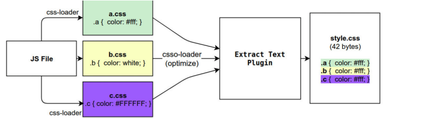
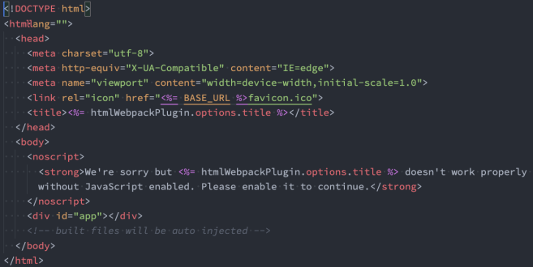
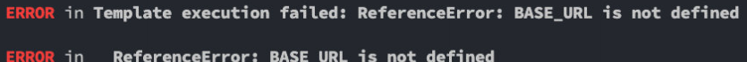

## webpack 常用的plugin
### 认识plugin
- Webpack的另一个核心是Plugin，官方有这样一段对Plugin的描述：
  + While loaders are used to transform certain types of modules, plugins can be leveraged to perform a wider range of tasks like bundle optimization, asset management and injection of environment variables.
- 上面表达的含义翻译过来就是：
  + Loader是用于**特定的模块类型进行转换**；
  + Plugin可以用于**执行更加广泛的任务**，比如打包优化、资源管理、环境变量注入等；
  

### CleanWebpackPlugin
- 前面我们演示的过程中，每次修改了一些配置，重新打包时，都需要**手动删除dist文件夹**：
  + 我们可以借助于一个插件来帮助我们完成，这个插件就是**CleanWebpackPlugin**；
- 首先，我们先安装这个插件：`npm install clean-webpack-plugin -D`
- 之后在插件中配置：
  ```js
    const { CleanWebpackPlugin } = require("clean-webpack-plugin");

    module.exports = {
      plugins: [
        new CleanWebpackPlugin()
      ]
    }
  ```

### HtmlWebpackPlugin
- 另外还有一个不太规范的地方：
  + 我们的HTML文件是编写在根目录下的，而最终打包的**dist文件夹中是没有index.html**文件的。
  + 在进行**项目部署**的时，必然也是需要有**对应的入口文件index.html**；
  + 所以我们也需要**对index.html进行打包处理**；
- 对HTML进行打包处理我们可以使用另外一个插件：HtmlWebpackPlugin；
  + `npm install html-webpack-plugin -D`
  ```js
    const HtmlWebpackPlugin = require("html-webpack-plugin");
    module.exports = {
      plugins: [
        new HtmlWebpackPlugin({
          title: "webpack案例"
        })
      ]
    }
  ```
#### 生成的index.html分析
- 我们会发现，现在自动在dist文件夹中，生成了一个index.html的文件：
  + 该文件中也自动添加了我们打包的bundle.js文件；
  
- 这个文件是如何生成的呢？
  + 默认情况下是根据**ejs的一个模板**来生成的；
  + 在html-webpack-plugin的源码中，有一个default_index.ejs模块；

#### 自定义HTML模板
- **如果我们想在自己的模块中加入一些比较特别的内容：**
  + 比如添加一个noscript标签，在用户的JavaScript被关闭时，给予响应的提示；
  + 比如在开发vue或者react项目时，我们需要一个可以挂载后续组件的根标签 `<div id="app"></div>`；
- 这个我们需要一个属于自己的index.html模块：
  

#### 自定义模板数据填充
- 上面的代码中，会有一些类似这样的**语法<% 变量 %>**，这个是**EJS模块填充数据**的方式。
- 在配置HtmlWebpackPlugin时，我们可以添加如下配置：
  + **template**：指定我们要使用的模块所在的路径；
  + **title**：在进行htmlWebpackPlugin.options.title读取时，就会读到该信息；
  ```js
    const HtmlWebpackPlugin = require("webpack-html-plugin");
    module.exports = {
      plugins: [
        new CleanWebpackPlugin(),
        new HtmlWebpackPlugin({
          title: "webpack项目",
          template: "./public/index.html"
        })
      ]
    }
  ```

### DefinePlugin
#### DefinePlugin的介绍
- 但是，这个时候编译还是会报错，因为在我们的模块中还使用到一个**BASE_URL的常量：**
  
- 这是因为在编译template模块时，有一个BASE_URL：
  + `<link rel="icon" href="<%= BASE_URL %>favicon.ico">`
  + 但是我们并没有设置过这个常量值，所以会出现没有定义的错误；
- 这个时候我们可以使用DefinePlugin插件；

#### DefinePlugin的使用
- DefinePlugin允许在编译时创建配置的全局常量，是一个webpack内置的插件（不需要单独安装）：
```js
  const { DefinePlugin } = require("webpack");
  module.exports = {
    plugins: [
      new DefinePlugin({
        BASE_URL: "./"
      })
    ]
  }
```
- 这个时候，编译template就可以正确的编译了，会读取到BASE_URL的值；
- 后续我们还会再讲DefinePlugin的一些其他用法。

### CopyWebpackPlugin
- 在vue的打包过程中，如果我们将一些文件放到public的目录下，那么这个目录会被复制到dist文件夹中。
  + 这个复制的功能，我们可以使用CopyWebpackPlugin来完成；
- 安装CopyWebpackPlugin插件：`npm install copy-webpack-plugin -D`
- 接下来配置CopyWebpackPlugin即可：
  + 复制的规则在patterns中设置；
  + **from**：设置从哪一个源中开始复制；
  + **to**：复制到的位置，可以省略，会默认复制到打包的目录下；
  + **globOptions**：设置一些额外的选项，其中可以编写需要忽略的文件：
    - .DS_Store：mac目录下回自动生成的一个文件；
    - index.html：也不需要复制，因为我们已经通过HtmlWebpackPlugin完成了index.html的生成；
  ```js
    new CopyWebpackPlugin({
      patterns: [
        {
          from: "public",
          globOptions: {
            ignore: [
              "**/.DS_Store",
              "**/index.html"
            ]
          }
        }
      ]
    })
  ```