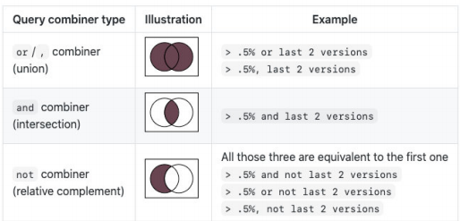

### webpack 官方文档
- webpack 的[官方文档是](https://webpack.js.org/)
  + [中文文档](https://webpack.docschina.org/)
  + DOCUMENTATION：文档详情，也是我们最关注的

- 点击 DOCUMENTATION 来到文档页
  + API: API，提供相关的接口，可以自定义编译的过程
  + BLOG: 博客，等同于上一个tab的Blog，里面有一些博客文章
  + CONCEPTS: 概念，主要是介绍一些webpack的核心概念，比如入口、出口、loaders、plugins等等，但这里并没有一些对它们解析的详细API
  + CONFIGURATION: 配置，webpack 详细的配置选项，都可以在这里查询到，更多的时候是作为查询手册
  + GUIDES: 指南，更像是webpack提供给我们的教程，我们可以按照这个教程一步一步去学习webpack的使用
  + LOADERS: loaders，webpack的核心之一，常见的loader都可以在这里查询到用法，比如css-loader、babel-loader、less-loader等
  + PLUGINS: plugins，webpack的核心之一，常见的plugin都可以在这里查询到用法，比如BannerPlugin、CleanWebpackPlugin、MiniCssExtractPlugin等
  + MIGRATE: 迁移，可以通过这里的教程将 webpack4 迁移到 webpack5


### webpack 的依赖
webpack 的运行是依赖Node环境的，所以我们电脑上要有Node环境
  - 先安装 Node.js，并且会同时安装 npm

### webpack 的安装
webpack的安装目前分为两个：webpack、webpack-cli
那么，它们是什么关系呢？
  - 执行webpack命令，会执行node_modules下的.bin目录下的webpack
  - webpack在执行是是依赖 webpack-cli的，如果没有安装就会报错
  - 而webpack-cli中的代码，才是真正利用webpack进行编译和打包的过程
  - 所以在安装webpack时，我们需要同时安装webpack-cli（第三方脚手架是没有使用webpack-cli的，而是类似于自己的 vue-service-cli的东西）

- 安装
  + 全局安装：npm install webpack webpack-cli -g
  + 局部安装：npm install webpack webpack-cli -D

### webpack 默认打包
- 我们可以通过webpack进行打包，之后运行打包之后的代码
  + 在目录下直接执行 webpack 命令
- 生成一个 dist 文件夹，里面存放一个 main.js 文件，就是我们打包之后的文件
  + 这个文件中的代码被压缩和丑化了
  + 打包后的代码依然存在ES6的语法，比如箭头函数、const等。这是因为默认情况下webpack并不清楚我们打包之后的文件是否需要转成ES5之前的语法，后续我们需要通过babel来进行转换和配置
- 我们发现是可以正常进行打包的，但是有一个问题，webpack 是如何确定打包的入口呢？
  + 事实上，当我们运行webpack时，webpack会查找当前目录下的 src/index.js 作为入口
  + 所以，如果当前项目没有存在 src/index.js 文件，就会报错
  + 这时候也可以通过配置来指定要打包的入口和出口：`npx webpack --entry ./src/main.js --output-path ./build`
- 其他详细配置可见[webpack官网](https://webpack.docschina.org/api/cli/)


### webpack 配置
#### webpack 配置文件
- 在通常情况下，webpack需要打包的项目是非常复杂的，并且我们需要一系列的配置来满足要求，默认配置必然是不可以的
- 我们可以在根目录下创建一个webpack.config.js文件，来作为webpack的配置文件：
  ```js
    const path = require('path');

    module.exports = {
      entry: "./src/main.js",
      output: {
        path: path.resolve(__dirname, "./build"),
        filename: 'bundle.js'
      }
    }
  ```
- 继续执行webpack命令，依然可以正常打包

#### 自定义配置文件
- 默认情况下webpack的配置文件是 webpack.config.js
- 但是如果我们的配置文件并不是webpack.config.js的名字，而是其他的名字呢？
  + 比如我们将webpack.config.js修改成了 wk.config.js；
  + 这个时候我们可以通过 --config 来指定对应的配置文件；
- 但是每次这样执行命令来对源码进行编译，会非常繁琐，所以我们可以在package.json中增加一个新的脚本：
  ```json
    {
      "script": {
        "build": "webpack --config wk.config.js"
      }
    }
  ```
- 之后我们执行 `npm run build` 来打包即可。


### Webpack依赖图
- webpack到底是如何对我们的项目进行打包的呢？
  + 事实上webpack在处理应用程序时，它会根据命令或者配置文件找到入口文件；
  + 从入口开始，会生成一个 **依赖关系图**，这个**依赖关系图**会包含应用程序中所需的所有模块（比如.js文件、css文件、图片、字体等）；
  + 然后遍历图结构，打包一个个模块（根据文件的不同使用不同的loader来解析）；


### 浏览器兼容性
- 我们来思考一个问题：开发中，浏览器的兼容性问题，我们应该如何去解决和处理？
  + 当然这个问题很笼统，这里我说的兼容性问题**不是指屏幕大小的变化适配；**
  + 我这里指的兼容性是针对不同的浏览器支持的特性：比如css特性、js语法，之间的兼容性；
- 我们知道市面上有大量的浏览器：
  + 有Chrome、Safari、IE、Edge、Chrome for Android、UC Browser、QQ Browser等等；
  + 它们的市场占率是多少？我们要不要兼容它们呢？
- 其实在很多的脚手架配置中，都能看到类似于这样的配置信息：
  + 这里的百分之一，就是指市场占有率
  ```txt
    > 1%
    last 2 versions
    not dead
  ```
#### 浏览器市场占有率
- 但是在哪里可以查询到浏览器的市场占有率呢？
  + 这个最好用的网站，也是我们工具通常会查询的一个网站就是caniuse；
  + [https://caniuse.com/usage-table](https://caniuse.com/usage-table)


#### 认识browserslist工具
- 但是有一个问题，我们如何可以在css兼容性和js兼容性下共享我们配置的兼容性条件呢？
  + 就是当我们设置了一个条件： > 1%；
  + 我们表达的意思是**css要兼容市场占有率大于1%的浏览器，js也要兼容市场占有率大于1%的浏览器；**
  + 如果我们是通过工具来达到这种兼容性的，比如后面我们会讲到的postcss-prest-env、babel、autoprefixer等
- 如何可以让他们共享我们的配置呢？
  + 这个问题的答案就是Browserslist；
- Browserslist是什么？Browserslist是一个在不同的前端工具之间，共享目标浏览器和Node.js版本的配置：
  + [Autoprefixer](https://github.com/postcss/autoprefixer)
  + [Babel](https://github.com/babel/babel/tree/master/packages/babel-preset-env)
  + [eslint-plugin-compat](https://github.com/amilajack/eslint-plugin-compat)
  + [stylelint-no-unsupported-browser-features](https://github.com/ismay/stylelint-no-unsupported-browser-features)
  - [postcss-normalize](https://github.com/csstools/postcss-normalize)
  - [obsolete-webpack-plugin](https://github.com/ElemeFE/obsolete-webpack-plugin)

#### 浏览器查询过程
- 我们可以编写类似于这样的配置：
  ```txt
    > 1%
    last 2 versions
    not dead
  ```
- 那么之后，这些工具会根据我们的配置来获取相关的浏览器信息，以方便决定是否需要进行兼容性的支持：
  + 条件查询使用的是caniuse-lite的工具，这个工具的数据来自于caniuse的网站上；

#### Browserslist编写规则一：
- 那么在开发中，我们可以编写的条件都有哪些呢？（加粗部分是最常用的）
- **defaults：Browserslist的默认浏览器（> 0.5%, last 2 versions, Firefox ESR, not dead）**
- **5%：通过全局使用情况统计信息选择的浏览器版本。 >=，<和<=工作过。**
  + 5% in US：使用美国使用情况统计信息。它接受两个字母的国家/地区代码。
  + \> 5% in alt-AS：使用亚洲地区使用情况统计信息。有关所有区域代码的列表，请参见caniuse-lite/data/regions
  + \> 5% in my stats：使用自定义用法数据。
  + \> 5% in browserslist-config-mycompany stats：使用 来自的自定义使用情况数据browserslist-config-mycompany/browserslist-stats.json。
  + cover 99.5%：提供覆盖率的最受欢迎的浏览器。
  + cover 99.5% in US：与上述相同，但国家/地区代码由两个字母组成。
  + cover 99.5% in my stats：使用自定义用法数据。
- **dead：24个月内没有官方支持或更新的浏览器。现在是IE 10，IE_Mob 11，BlackBerry 10，BlackBerry 7， Samsung 4和OperaMobile 12.1。**
- **last 2 versions：每个浏览器的最后2个版本**
  + last 2 Chrome versions：最近2个版本的Chrome浏览器。
  + last 2 major versions或last 2 iOS major versions：最近2个主要版本的所有次要/补丁版本。

#### Browserslist编写规则二：
- node 10和node 10.4：选择最新的Node.js10.x.x 或10.4.x版本。
  + current node：Browserslist现在使用的Node.js版本。
  + maintained node versions：所有Node.js版本，仍由 Node.js Foundation维护。
- iOS 7：直接使用iOS浏览器版本7。
  + Firefox > 20：Firefox的版本高于20 >=，<并且<=也可以使用。它也可以与Node.js一起使用
  + ie 6-8：选择一个包含范围的版本。
  + Firefox ESR：最新的[Firefox ESR]版本。
  + PhantomJS 2.1和PhantomJS 1.9：选择类似于PhantomJS运行时的Safari版本。
- extends browserslist-config-mycompany：从browserslist-config-mycompanynpm包中查询
- supports es6-module：支持特定功能的浏览器。 es6-module这是“我可以使用” 页面feat的URL上的参数。有关所有可用功能的列表，请参见 。caniuselite/data/features
- browserslist config：在Browserslist配置中定义的浏览器。在差异服务中很有用，可用于修改用户的配置，例如 browserslist config and supports es6-module
- since 2015或last 2 years：自2015年以来发布的所有版本（since 2015-03以及since 2015-03-10）。
- unreleased versions或unreleased Chrome versions：Alpha和Beta版本。
- **not ie <= 8：排除先前查询选择的浏览器。**

#### 命令行使用browserslist
- 我们可以直接通过命令来查询某些条件所匹配到的浏览器：`npx browserslist ">1%, last 2 version, not dead"`

#### 配置browserslist
- 我们如何可以配置browserslist呢？两种方案：
  + 方案一：在package.json中配置；
  + 方案二：单独的一个配置文件.browserslistrc文件；
- 方案一：package.json配置：
  ```json
    {
      "browserslist": {
        "last 2 version",
        "not dead",
        "> 0.2%"
      }
    }
  ```
- 方案二：.browserslistrc文件
  ```txt
    > 0.5%
    last 2 version
    not dead
  ```
#### 默认配置和条件关系
- 如果没有配置，那么也会有一个默认配置：
  ```js
    browserslist.defaults = [
      '> 0.5%',
      'last 2 version',
      'Firefox ESR',
      'not dead',
    ]
  ``` 
- 我们编写了多个条件之后，多个条件之间是什么关系呢？
  


### 认识PostCSS工具
- 什么是PostCSS呢
  + PostCSS是一个通过JavaScript来转换样式的工具；
  + 这个工具可以帮助我们进行一些CSS的转换和适配，比如自动添加浏览器前缀、css样式的重置；
  + 但是实现这些工具，我们需要借助于PostCSS对应的插件；
- 如何使用PostCSS呢？主要就是两个步骤：
  1. 第一步：查找PostCSS在构建工具中的扩展，比如webpack中的postcss-loader；
  2. 第二步：选择可以添加你需要的PostCSS相关的插件；

#### 命令行使用postcss
- 当然，我们能不能也直接在终端使用PostCSS呢
  + 也是可以的，但是我们需要单独安装一个工具postcss-cli
- 我们可以安装一下它们：postcss、postcss-cli：`npm install postcss postcss-cli -D`
- 我们编写一个需要添加前缀的css：
  + [https://autoprefixer.github.io/](https://autoprefixer.github.io/)
  + 我们可以在上面的网站中查询一些添加css属性的样式；
    ```css
      :fullscreen {
        color: red;
      }

      .content: {
        user-select: none;
      }
    ```

#### 插件autoprefixer
- 因为我们需要添加前缀，所以要安装autoprefixer：`npm install autoprefixer -D` 
- 直接使用使用postcss工具，并且制定使用autoprefixer
  + `npx postcss --use autoprefixer -o end.css ./src/css/style.css`
- 转化之后的css样式如下
  ```css
    :-ms-fullscreen {
    }

    :full-screen {
    }

    .content {
      -webkit-user-select: none;
      -moz-user-select: none;
      -ms-user-select: none;
      user-select: none;
    }
  ```

#### postcss-loader
- 真实开发中我们必然不会直接使用命令行工具来对css进行处理，而是可以借助于构建工具
  + 在webpack中使用postcss就是使用postcss-loader来处理的
- 我们来安装postcss-loader：`npm install postcss-loader -D`
- 我们修改加载css的loader：（配置文件已经过多，给出一部分了）
  + 注意：因为postcss需要有对应的插件才会起效果，所以我们需要配置它的plugin；
  ```js
    {
      loader: "postcss-loader",
      options: {
        postcssOptions: {
          plugins: [
            require('autoprefixer')
          ]
        }
      }
    }
  ```

#### 单独的postcss配置文件
- 当然，我们也可以将这些配置信息放到一个单独的文件中进行管理：
  + 在根目录下创建postcss.config.js
  ```js
    module.exports = {
      plugins: [
        require('autoprefixer')
      ]
    }
  ```

#### postcss-preset-env
- 事实上，在配置postcss-loader时，我们配置插件并不需要使用autoprefixer
- 我们可以使用另外一个插件：postcss-preset-env
  + postcss-preset-env也是一个postcss的插件；
  + 它可以帮助我们将一些现代的CSS特性，转成大多数浏览器认识的CSS，并且会根据目标浏览器或者运行时环境添加所需的polyfill；
  + 也包括会自动帮助我们添加autoprefixer（所以相当于已经内置了autoprefixer）
- 首先，我们需要安装postcss-preset-env：`npm install postcss-preset-env -D`
- 之后，我们直接修改掉之前的autoprefixer即可：
  ```js
    plugins: [
      require('postcss-preset-env')
    ]
  ```
- **注意：**我们在使用某些postcss插件时，也可以直接传入字符串
  ```js
    module.exports = {
      plugins: [
        "postcss-preset-env"
      ]
    }
  ```

#### 举个例子
- 我们举一个例子：
  + 我们这里在使用十六进制的颜色时设置了8位；
  + 但是某些浏览器可能不认识这种语法，我们最好可以转成RGBA的形式；
  + 但是autoprefixer是不会帮助我们转换的；
  + 而postcss-preset-env就可以完成这样的功能；
  ```css
    .content {
      color: #12345678;
    }
  ```

### Mode 配置
- 前面我们一直没有讲mode，但是在这里我们要简单讲一下，后面还会提到它的其他用法。
- Mode配置选项，可以告知webpack使用响应模式的内置优化：
  + 默认值是production（什么都不设置的情况下）；
  + 可选值有：'none' | 'development' | 'production'；
- 这几个选项有什么样的区别呢?
  

#### Mode配置代表更多
  
  


### Webpack的模块化
- Webpack打包的代码，允许我们使用各种各样的模块化，但是最常用的是CommonJS、ES Modul
  + 那么它是如何帮助我们实现了代码中支持模块化呢？
- 我们来研究一下它的原理，包括如下原理
  + CommonJS模块化实现原理；
  + ES Module实现原理；
  + CommonJS加载ES Module的原理；
  + ES Module加载CommonJS的原理；
- 这里不再给出代码，查看课堂代码的注释解析

### 认识source-map
- 我们的代码通常运行在浏览器上时，是通过打包压缩的：
  + 也就是真实跑在浏览器上的代码，和我们编写的代码其实是有差异的
  + 比如ES6的代码可能被转换成ES5；
  + 比如对应的代码行号、列号在经过编译后肯定会不一致；
  + 比如代码进行丑化压缩时，会将编码名称等修改；
  + 比如我们使用了TypeScript等方式编写的代码，最终转换成JavaScript；

- 但是，当代码报错需要调试时（debug），调试转换后的代码是很困难的
- 但是我们能保证代码不出错吗？不可能
- 那么如何可以调试这种转换后不一致的代码呢？答案就是**source-map**
  + source-map是从已转换的代码，映射到原始的源文件；
  + 使浏览器可以**重构原始源**并在调试器中**显示重建的原始源** 

#### 如何使用source-map
- 如何可以使用source-map呢？两个步骤
  + 第一步：根据源文件，生成source-map文件，webpack在打包时，可以通过配置生成source-map；
  + 第二步：在转换后的代码，最后添加一个注释，它指向sourcemap；
  + `//# sourceMappingURL=common.bundle.js.map`
- 浏览器会根据我们的注释，查找响应的source-map，并且根据source-map还原我们的代码，方便进行调试
- 在Chrome中，我们可以按照如下的方式打开source-map：
  

#### 分析source-map
- 最初source-map生成的文件带下是原始文件的10倍，第二版减少了约50%，第三版又减少了50%，所以目前一个133kb的文件，最终的source-map的大小大概在300kb
- 目前的source-map长什么样子呢？
  + **version**：当前使用的版本，也就是最新的第三版；
  + **sources**：从哪些文件转换过来的source-map和打包的代码（最初始的文件）；
  + **names**：转换前的变量和属性名称（因为我目前使用的是development模式，所以不需要保留转换前的名称）；
  + **mappings**：source-map用来和源文件映射的信息（比如位置信息等），一串base64 VLQ（veriablelength quantity可变长度值）编码
  + **file**：打包后的文件（浏览器加载的文件）；
  + **sourceContent**：转换前的具体代码信息（和sources是对应的关系）；
  + **sourceRoot**：所有的sources相对的根目录；

#### source-map文件
- 参考文档（MDN）[https://developer.mozilla.org/enUS/docs/Mozilla/JavaScript_code_modules/SourceMap.jsm](https://developer.mozilla.org/enUS/docs/Mozilla/JavaScript_code_modules/SourceMap.jsm)
  

#### 生成source-map
- 如何在使用webpack打包的时候，生成对应的source-map呢？
  + webpack为我们提供了非常多的选项（目前是26个），来处理source-map；
  + [https://webpack.docschina.org/configuration/devtool/](https://webpack.docschina.org/configuration/devtool/)
  + 选择不同的值，生成的source-map会稍微有差异，打包的过程也会有**性能的差异**，可以根据不同的情况进行选择；
- 下面几个值不会生成source-map
  + false：不使用source-map，也就是没有任何和source-map相关的内容。
  + none：production模式下的默认值，不生成source-map
  + eval：development模式下的默认值，不生成source-map
    - 但是它会在eval执行的代码中，添加 //# sourceURL=；
    - 它会被浏览器在执行时解析，并且在调试面板中生成对应的一些文件目录，方便我们调试代码；
  - eval的效果
    
    

#### source-map值
- source-map：
  + 生成一个独立的source-map文件，并且在bundle文件中有一个注释，指向source-map文件；
- bundle文件中有如下的注释：
  + 开发工具会根据这个注释找到source-map文件，并且解析；`//# sourceMappingURL=bundle.js.map`
    
  

#### eval-source-map值
- eval-source-map：会生成sourcemap，但是source-map是以DataUrl添加到eval函数的后面

#### inline-source-map值
- inline-source-map：会生成sourcemap，但是source-map是以DataUrl添加到bundle文件的后面

#### cheap-source-map
- cheap-source-map：
  + 会生成sourcemap，但是会更加高效一些（cheap低开销），因为它没有生成列映射（Column Mapping）
  + 因为在开发中，我们只需要行信息通常就可以定位到错误了

#### cheap-module-source-map值
- cheap-module-source-map：
  + 会生成sourcemap，类似于cheap-source-map，但是对源自**loader的sourcemap处理会更好**
- 这里有一个很模糊的概念：对源自loader的sourcemap处理会更好，官方也没有给出很好的解释
  + 其实是如果loader对我们的源码进行了特殊的处理，比如babel；
- 如果我这里使用了babel-loader（注意：目前还没有讲babel）
  + 可以先按照我的babel配置演练；
  ```js
    rules: [
      {
        test: /\.js&/,
        user: {
          loader: 'babel-loader',
          options: {
            presets: [
              ['@babel/preset-env', { targets: 'defaults' }]
            ]
          }
        }
      }
    ]
  ```

#### cheap-source-map和cheap-module-source-map
- cheap-source-map和cheap-module-source-map的区别：
  

#### hidden-source-map值
- hidden-source-map：
  + 会生成sourcemap，但是**不会对source-map文件进行引用**；
  + 相当于删除了打包文件中对sourcemap的引用注释；
  ```js
    // 被删除掉的
    //# sourceMappingURL=bundle.js.map
  ```
- 如果我们手动添加进来，那么sourcemap就会生效了

#### nosources-source-map值
- nosources-source-map：
  + 会生成sourcemap，但是生成的sourcemap只有错误信息的提示，不会生成源代码文件
- 正确的错误提示：
  
- 点击错误提示，无法查看源码
  

#### 多个值的组合
- 事实上，webpack提供给我们的26个值，是可以进行多组合的。
- 组合的规则如下：
  + inline-|hidden-|eval：三个值时三选一；
  + nosources：可选值；
  + cheap可选值，并且可以跟随module的值；
    `[inline-|hidden-|eval-][nosources-][cheap-[module-]]source-map`
- 那么在开发中，最佳的实践是什么呢？
  + **开发阶段**：推荐使用 source-map或者cheap-module-source-map
    - 这分别是vue和react使用的值，可以获取调试信息，方便快速开发；
  + **测试阶段**：推荐使用 source-map或者cheap-module-source-map
    - 测试阶段我们也希望在浏览器下看到正确的错误提示；
  + **发布阶段**：false、缺省值（不写）